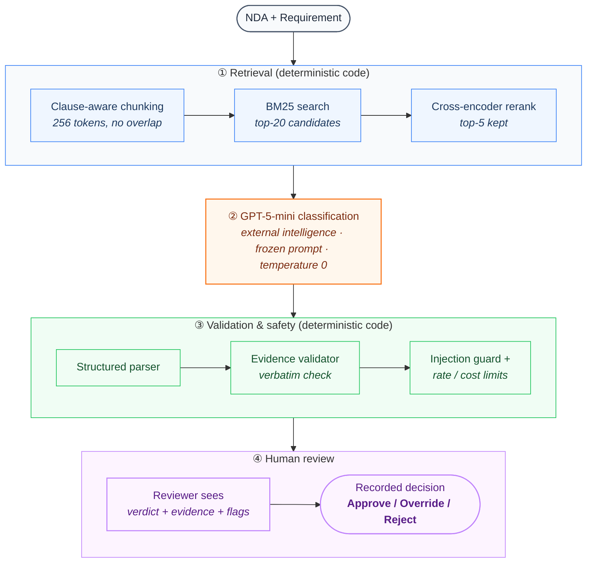

# NDATrace — Product Documentation

One-page reference: who this is for, what goes in and out, how input becomes output, and what
was targeted versus reached. Full detail, reproducibility steps, and the complete evaluation
story live in [`README.md`](README.md); this file exists so the persona/input/output/architecture
/metrics are each findable in one place without reading the whole README.

## Persona

**Tina, a legal operations analyst, not a lawyer.** She gets a vendor NDA and has to check it
against her company's standard confidentiality checklist before a lawyer looks at it. Relevant
wording is often paraphrased, qualified by an exception, or scattered across clauses — keyword
search misses that, and an unsupported LLM answer gives her nothing to check it against. Today
she reads the whole NDA clause by clause. With NDATrace she gets a verdict per requirement, each
with its supporting clause, reviews the flagged or uncertain ones first, and records her
decision. She is never asked to trust the system; she is shown what it is based on.

## Input / Output

| | |
| --- | --- |
| **Input** | One NDA (pasted or uploaded as PDF), checked against one or more of 17 fixed confidentiality requirements (ContractNLI's hypothesis set) |
| **Output** | One verdict per requirement checked: label (Entailment / Contradiction / Not Mentioned), the exact cited clause (verbatim, never paraphrased), a short explanation, and any review/security flags |

Each requirement is scored independently — one model call per requirement, nothing about
Requirement 1's evidence or verdict influences Requirement 2's — so partial selections (just the
3 that matter for a given deal) work the same way a full 17-requirement run does. The reviewer's
final Approve/Override/Reject decision is persisted and auditable; the model never auto-approves.

## High-level architecture

How one input (NDA + requirement) transforms into one output (verdict + evidence + reviewer
decision), and where code logic versus external intelligence (the LLM) sits:

Orange is the one external-intelligence call (the rented LLM). Blue and green are deterministic,
project-owned code — no model involved. Purple is the human in the loop: there is no automatic
confidence gate, so every result reaches a reviewer. Matches `pipeline/frozen_rag.py` and
`pipeline/final_review.py` directly.

## Metrics: targeted vs. reached

| | Metric | Target | Reached (measured) | Status |
| --- | --- | --- | --- | --- |
| Primary | Joint correctness (label + evidence), FULL vs. RAG | Required to be measured and disclosed | 74.6% (FULL) / 72.5% (RAG), n=2,091 | Reported as measured |
| Secondary | Risk-sensitive recall gain, RAG over **Rule-based (non-AI baseline)** | ≥ 5.0 points | **+16.6 points** (53.6% → 70.3%) | Met, by a wide margin |
| Secondary | Risk-sensitive recall gain, RAG over **FULL-context LLM**, reported separately | Problem Statement Section 7's literal wording | **+1.2 points** (69.1% → 70.3%) | Would not clear the bar alone; not the project's baseline |
| Secondary | Contradiction recall, reported separately (not averaged away) | Required, not fixed | 75.5% (FULL) / 77.3% (RAG) | Reported separately |

Official ContractNLI TEST split, n = 2,091, all three systems (Rule / FULL / RAG) on the
identical population. Source: `experiments/E20_final_rag_test/results/E20_final_report.json`,
`results/final/v2/full_test_comparison.csv`. Rule-based keyword retrieval is the project's
non-AI baseline (Problem Statement Section 4) and the target's comparison point; the
FULL-context wording from Problem Statement Section 7 is reported alongside it, not substituted
for it.

Full targeted-vs-reached discussion, the two-population distinction (TEST n=2,091 vs. the
49-case targeted battery), and business-economics modeling: see
[`README.md#metrics-targeted-vs-reached`](README.md#metrics-targeted-vs-reached) and the final
report (submitted separately).
