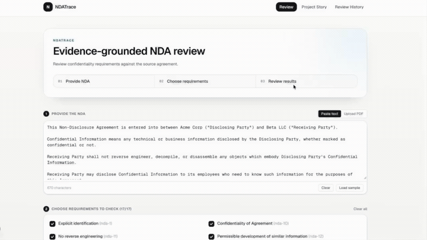
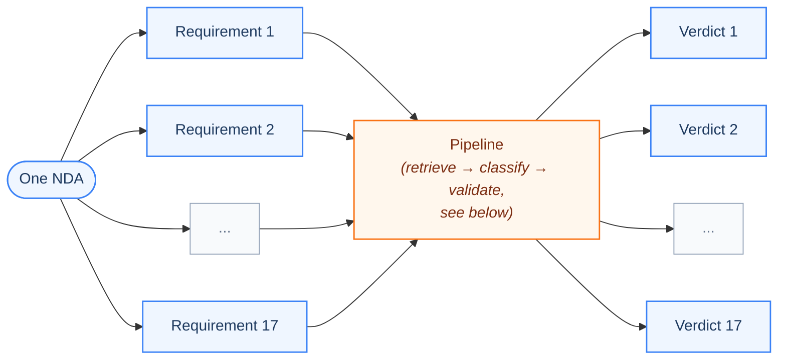
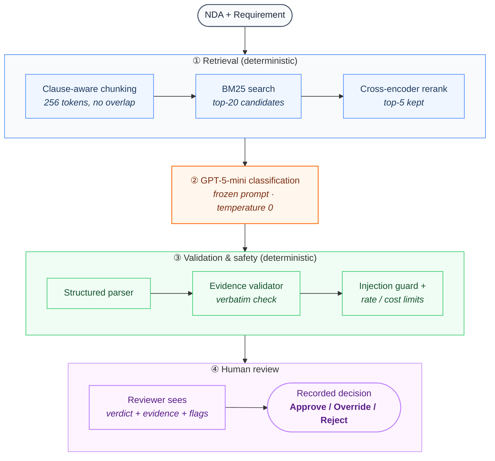
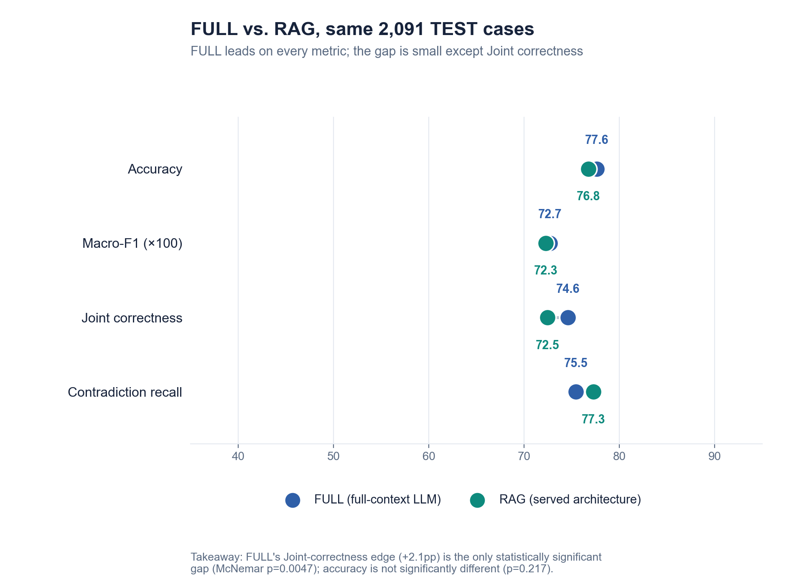
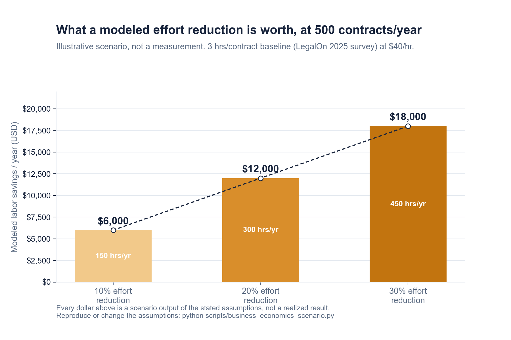
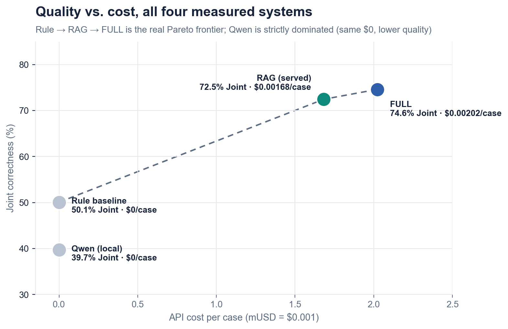
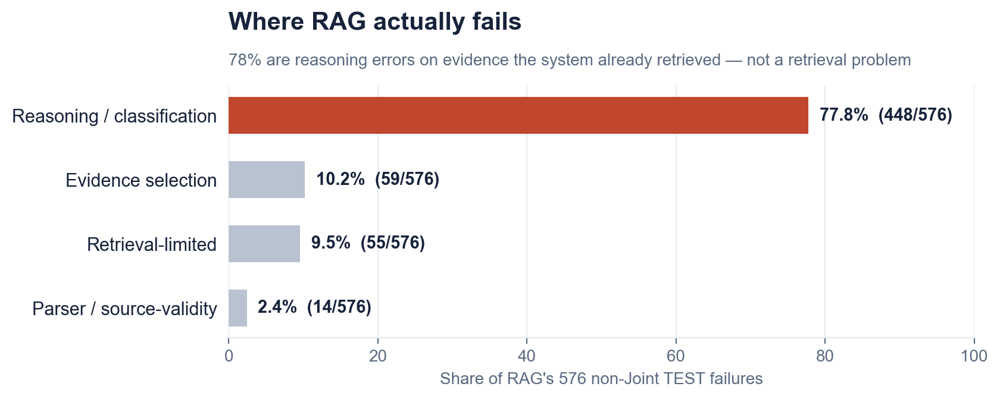

<div align="center">

# NDATrace

### An evidence-grounded NDA review assistant. Every verdict comes with the clause it's based on.




*One NDA requirement from input → retrieved evidence → verdict → reviewer decision.*

[Persona](#tinas-problem) · [What it does](#what-ndatrace-does) · [Architecture](#high-level-architecture) · [Metrics](#metrics-targeted-vs-reached) · [Design decisions](#key-design-decisions) · [Quick start](#quick-start) · [Reproducibility](#reproducibility) · [Data & evals](#data-and-evals) · [Repo map](#repository-map) · [Limitations](#limitations) · [Deliverables](#project-deliverables)

</div>

---

> **Product documentation (persona, input/output, architecture diagram, metrics targeted vs. reached) as a standalone one-pager:** [`PRODUCT.md`](PRODUCT.md).

---

> **Authoritative final submission report:** [NDATrace_Final_Report.pdf](NDATrace_Final_Report.pdf).

---

> ### "It got the right answer without finding the right clause."
>
> That's the failure plain accuracy hides. My headline metric is **Joint
> correctness**: label and cited evidence both have to be right, not accuracy alone. Numbers
> below in [Metrics](#metrics-targeted-vs-reached).

---

## Tina's problem

**Tina is a legal operations analyst, not a lawyer.**

She gets a vendor NDA and has to check it against her company's standard confidentiality
checklist before a lawyer looks at it. The hard part is that relevant wording is often
paraphrased, qualified by an exception, or scattered across clauses. Keyword search misses that.
A generic LLM answer doesn't fix it either, since she has no way to check what it's actually
based on.

Today she reads the whole NDA clause by clause to make sure nothing was missed. With NDATrace
she gets a verdict per requirement, each with its supporting clause, reviews the flagged or
uncertain ones first, and records her decision. I never ask her to trust the system; I show her
what it's based on. I make no review-time or productivity claim here; see
[What's measured](#whats-measured-whats-not).

### Why not an existing tool

Commercial contract-review products (Ironclad, Luminance, Kira, among others) already support
AI-assisted review. Their open challenge, and my stated reason for building this instead of
buying it, is handling incomplete, conflicting, or ambiguous evidence: whether to answer, search
further, or escalate to a human. I kept NDATrace narrower than any of these products on purpose.
It covers one task (confidentiality requirement classification against ContractNLI's 17 fixed
hypotheses) and I treat "cite the clause, let a human verify it, or flag for review" as the
actual deliverable, not a feature bolted onto a broader platform.

## What NDATrace does

I built it to label an NDA against each of 17 fixed confidentiality requirements as Entailment,
Contradiction, or Not Mentioned, cite the supporting clause, flag anything uncertain for human
review, and record the reviewer's final decision. It doesn't approve an NDA or make a legal call
on its own — I kept that authority with the reviewer.

| | |
| --- | --- |
| **Input** | One NDA (pasted or uploaded), checked against one or more of the 17 fixed confidentiality requirements |
| **Output** | One verdict per requirement checked: label, the exact cited clause (verbatim, never paraphrased), a short explanation, and any review/security flags |

One NDA is never checked against more than these 17 requirements, and each requirement is scored
independently, so partial selections (just the 3 that matter for this deal) work the same way a
full 17-requirement run does:



Each requirement goes through retrieval and classification independently (one model call per
requirement); nothing about Requirement 1's evidence or verdict influences Requirement 2's.

I built and evaluated this on [ContractNLI](https://stanfordnlp.github.io/contract-nli/), a
public NDA benchmark. That's not a claim of performance on real confidential enterprise
contracts, and I don't make one.

## High-level architecture



Orange is the one LLM call. Green is deterministic code, no model involved. Purple is the human
in the loop: I didn't build an automatic confidence gate, so every result reaches a reviewer.
This matches `pipeline/frozen_rag.py` and `pipeline/final_review.py` directly.

## Metrics: targeted vs. reached

| | Metric | Target | Reached (measured) | Status |
| --- | --- | --- | --- | --- |
| Primary | Joint correctness (label + evidence), FULL vs. RAG | Required to be measured and disclosed | 74.6% (FULL) / 72.5% (RAG), n=2,091 | ✅ Reported as measured |
| Secondary | Risk-sensitive recall gain, RAG over **Rule-based (non-AI baseline)** | ≥ 5.0 points | **+16.6 points** (53.6% → 70.3%) | ✅ Met, by a wide margin |
| Secondary | Contradiction recall, reported separately (not averaged away) | Required, not fixed | 75.5% (FULL) / 77.3% (RAG) | ✅ Reported separately |

Risk-sensitive recall is the macro-average of Contradiction and NotMentioned recall (not pooled over cases; a pooled figure is dominated by NotMentioned, where the rule system scores highest because it defaults to that label).

Official ContractNLI TEST split, n = 2,091, all three systems on the identical population.
Source: `experiments/E20_final_rag_test/results/E20_final_report.json`,
`results/final/v2/full_test_comparison.csv`. I use rule-based keyword retrieval as my non-AI
baseline (Problem Statement Section 4) and the target's comparison point.

**System roles:** RAG is the current interactive prototype; FULL is the quality-reference
comparator; Rule remains the non-AI baseline, with its existing definition and results unchanged.
The higher FULL Joint score is reported as measured, not hidden or reinterpreted.



**Takeaway:** FULL's Joint-correctness edge is the only statistically significant gap (McNemar
p=0.0047); accuracy isn't significantly different (p=0.217). More detail in
[`experiments/E20_final_rag_test/summary.md`](experiments/E20_final_rag_test/summary.md).

### Two populations, never merged into one number

| Population | Rule | FULL | RAG |
| --- | ---: | ---: | ---: |
| **2,091-case official TEST benchmark** (headline numbers above) | 59.0% acc / 50.1% joint | 77.6% acc / 74.6% joint | 76.8% acc / 72.5% joint |
| **49-case targeted evaluation** (E24: golden + negative + evidence-quality battery, deliberately includes the hardest known case family) | 51.0% acc / 44.9% joint | 73.5% acc / 73.5% joint | 71.4% acc / 67.3% joint |

The targeted set is a regression check on cases I already hand-curated to be hard, which I ran
against the current architecture for the first time. It's not a second benchmark, and lower numbers
here don't revise the TEST result above. It surfaced findings the TEST-scale numbers can't: the
exception/carve-out weakness documented in ADR-011 persists today (3 of 4 known cases still
fail); I traced one case (038) to the exact clause FULL over-weighted and RAG's narrower
context avoided: direct evidence that full-document access isn't strictly safer than retrieval,
and I diagnosed RAG's two evidence-grounding failures (correct label, insufficient cited
evidence) down to exact gold-span coverage, not just scored pass/fail. Both are retrieval
coverage gaps, not pure model errors. Full case-level detail:
[`experiments/E24_targeted_evaluation/summary.md`](experiments/E24_targeted_evaluation/summary.md).

### What's measured, what's not

I measure inference cost and model quality directly: RAG runs $0.00168/case, FULL
$0.00202/case (`experiments/E20_final_rag_test/results/E20_final_report.json`). I have not
measured end-to-end reviewer time savings; I ran no productivity study. What follows is a
modeled, explicit scenario, not a result.

I model business impact using a published contract-review-time benchmark plus explicit
scenario assumptions, kept in three separate, clearly labeled categories:

| Category | What it is |
| --- | --- |
| **Measured by NDATrace** | Inference cost/case, input tokens, latency. All read from saved run artifacts. |
| **Externally sourced baseline** | LegalOn Technologies, *2025 State of Contracting Survey* (n=286, published 15 Jan 2025): 52% of organizations handle 101–1,000 contracts/year at 2–4 hours of review per contract. Vendor research (LegalOn sells AI contract review software), not independently verified academic evidence. [Source](https://www.legalontech.com/press-releases/2025-survey), citation review: [`docs/citation_fixes.md`](docs/citation_fixes.md). |
| **Modeled / illustrative** | Assumed effort-reduction percentage, assumed hourly rate, resulting hours and labor-cost scenarios. Explicit assumptions, not fitted to any target. |



**Takeaway:** labor cost scales linearly with the assumed reduction rate by construction (it's a
formula, not a model fit); the point of the chart is the absolute scale ($6,000 to $18,000/year
at this volume), not the shape. Baseline: 3 hours/contract (midpoint of the published 2 to 4 hour
range), 500 contracts/year, $40/hour. Every one of those three numbers is a stated assumption.

Formula, fully transparent: `annual_hours = contracts/year × baseline_hours/contract`,
`hours_saved = annual_hours × assumed_reduction_rate`, `labor_savings = hours_saved × assumed_hourly_rate`.
Reproduce or change the assumptions: `python scripts/business_economics_scenario.py`.

I conducted no productivity study. These numbers show potential economic scale under stated
assumptions, not a realized or proven ROI. Treat the percentages as illustrative inputs, not
findings.

## Key design decisions

### The architecture ladder

I start at the cheapest rung and make each escalation earn itself: I built and measured four
architectures against each other, not assumed, in order.

| Alternative | Verdict |
| --- | --- |
| Majority-class guess (always predict Entailment) | 46.3% accuracy / 0% Joint (`E04B`) — the floor accuracy alone must clear to mean anything |
| Rule-based keyword baseline | 59.0% accuracy / 50.1% Joint, insufficient, justified an LLM |
| Full-context LLM (FULL) | Strongest measured quality, kept as the benchmark reference |
| Retrieval-augmented generation (RAG) | Bounded cost/context, kept as the served architecture |
| Selective agentic investigation | Zero tool calls on 15 real escalated cases, net benefit 0.0pp, rejected |

I tested automatic confidence-routing too (E15). No policy hit both an acceptable review
workload and an acceptable error rate, so I kept every result routing to a human.



**Takeaway:** Rule → RAG → FULL is the real Pareto frontier; the local Qwen comparator is
strictly dominated (same $0 cost, lower Joint correctness).

Trade-offs I made, explicitly:

- **Quality for cost/scale.** I retained RAG as the prototype runtime because it provides
  bounded context and lower measured inference cost, while accepting a measured 2.1-point
  Joint-correctness gap to FULL. Long-document scalability remains untested.
- **Simplicity over capability.** I rejected the agent and auto-routing after measuring them,
  not before. Both added real cost and earned nothing back on this data.
- **Operational simplicity over retrieval complexity.** BM25 plus a reranker tied dense/hybrid
  retrieval on quality, and BM25 needs no vector index to operate, so I kept BM25.



**Takeaway:** Retrieval was not the dominant failure source in E20. Only 10% of RAG's failures
are retrieval-limited; 78% are reasoning errors on evidence it already found. Full breakdown in
[`docs/failure_analysis.md`](docs/failure_analysis.md), with one real case walked through step
by step in [`examples/case_failure/`](examples/case_failure/).

The full 25-experiment ledger (E00–E24), each with its question, finding, and decision, is in
[`docs/experiment_registry.md`](docs/experiment_registry.md).

### Why not low-code

I didn't try a no-code/low-code tool (a hosted assistant builder, a model playground, a workflow
builder like n8n or Zapier, an AutoML trainer) before writing code. I decided to go straight to
code upfront, not after an attempted shortcut failed: the product's actual requirements I needed
(a reviewer decision API with an append-only audit trail, a deterministic verbatim-evidence
validator sitting between the model and the user, per-document BM25 retrieval, an offline
gold-aware evaluation harness kept separate from the gold-blind runtime) are integration and
control logic, not something a configured prompt-and-parameters console exposes. A low-code tool
can wrap a single model call; it cannot own the retrieval pipeline, the evidence verification
step, or the reviewer-decision persistence my core argument depends on. I'm disclosing that
judgment call here rather than leaving it unstated.

### Build vs. buy, by layer

What I rent, what I reuse off the shelf, and what I actually own as engineering, compared
against what I originally proposed for each layer:

| Layer | Decision | Proposed (Problem Statement) | Final |
| --- | --- | --- | --- |
| Compute / model | Rent | OpenRouter-hosted GPT-5-mini + local Llama 3.2 3B | OpenRouter-hosted GPT-5-mini; local comparator moved to Qwen2.5-7B (Llama 3.2 3B dropped, see [`docs/citation_fixes.md`](docs/citation_fixes.md) item 5) |
| Data | Own | ContractNLI + custom preprocessing/index | Unchanged |
| Vector store | Use existing | FAISS locally | Not used in the frozen path: production retrieval is BM25-only (E06 found dense/hybrid earned nothing once reranking was added) |
| Embedding model | Use existing | sentence-transformers/all-mpnet-base-v2 | Kept for the (unused-in-production) dense-retrieval comparison only |
| Retrieval, orchestration, evals | Build | Chunking, indexing, top-K retrieval, evidence mapping, reviewer decision API, evaluation harness | Unchanged, this is the project-specific logic |
| Serving / interface | Build | Streamlit | **Next.js + FastAPI, not Streamlit as originally proposed.** Streamlit was the Week-3 plan for a quick demo UI; the reviewer decision API (Approve/Override/Reject, append-only audit trail) needed a real backend, so the interface became a proper frontend/backend split instead of a single Streamlit script. |

I rent or reuse the model and standard libraries; I own the retrieval pipeline, evaluation
harness, reviewer decision API, injection guard, and reproducibility harness as
project-specific engineering.

## Quick start

**Requirements:** Python 3.12, Node.js ≥20.9 + npm. Internet access is required for initial
dependency installation, the ContractNLI dataset download, and the pretrained embedding/reranker
model downloads. After dependencies and those assets are present locally, the offline tests and
saved-result reproducibility checks do not need internet. A valid OpenRouter API key and internet
connection are needed for hosted review calls.

```bash
# 1. Clone and set up Python
git clone https://github.com/AsmithaUbaid/ndatrace.git && cd ndatrace
python3.12 -m venv .venv && source .venv/bin/activate
python -m pip install -r requirements.txt

# 2. Get the dataset and configure
bash scripts/download_data.sh     # downloads + checksum-verifies ContractNLI
cp .env.example .env              # safe placeholders, no key required to start
python scripts/verify_environment.py

# 3. Run the backend
uvicorn backend.app:app --reload  # http://localhost:8000

# 4. Run the frontend (new terminal)
cd frontend && npm ci && npm run dev   # http://localhost:3000
```

`GET /health` works without a key. Review endpoints return a clear config error until
`OPENROUTER_API_KEY` is set. The first run of `scripts/download_data.sh` downloads ContractNLI
and therefore requires internet; later runs verify the local dataset checksums without
downloading. Prefetch the reranker/embedding models with
`python scripts/download_models.py`.

To verify instead of run (tests, type-checks, full reproducibility), see
[Reproducibility](#reproducibility) below. I kept it a separate section so this one stays about
running the product, not proving it.

## Reproducibility

| | Cost | What it proves |
| --- | --- | --- |
| A. Reproduce metrics from saved outputs | Free | Every number on this page recomputes from committed predictions, not a live model. |
| B. Run one real request through the live pipeline | Free (stub) or ~$0.002 (`--live`) | The real code path, chunk → retrieve → rerank → classify → validate, works end to end. |
| C. Rerun large-scale paid inference | Real API cost | Not part of normal verification, not done casually. |

```bash
# A: one command: local dataset checksum, full pytest, every offline analysis script,
# byte-for-byte drift check, and in-process backend checks. No API key needed.
# If the dataset is not present, step 1 downloads it and requires internet.
python scripts/verify_reproducibility.py

# B: one real NDA through the real pipeline (pipeline/frozen_rag.py + final_review.py)
python experiments/E00_smallest_slice/run_smallest_slice.py          # dry-run, $0, no key needed
python experiments/E00_smallest_slice/run_smallest_slice.py --live   # one real call, ~$0.002
```

`--live` is the only command on this page that calls a hosted model. It needs your own
`OPENROUTER_API_KEY` in `.env` (see [Quick start](#quick-start)); nothing else in this section
requires a key. Reproducibility check A performs no network requests when the verified dataset is
already downloaded; its dataset-check step downloads ContractNLI (and therefore requires
internet) if any split is missing.

I left C with no copy-paste command on purpose: it means re-running a full experiment at TEST
scale (for example `python scripts/run_e20_hosted_test.py`, the script behind the 2,091-case
headline result), which costs real money (my own E20 run was $3.52) and takes close to an hour.
If you want to verify it yourself rather than trust my saved output, the script is there, but I
don't run it casually or as a routine check, and I don't expect you to either.

<details>
<summary>Sample output: A</summary>

```text
============================================================
REPRODUCIBILITY CHECK SUMMARY
============================================================
  [PASS] 1. Dataset present and checksum-verified
  [PASS] 2. Full test suite (zero paid calls)
  [PASS] 3. Offline analysis scripts recompute without error
  [PASS] 4. Recomputed results match committed files exactly (git diff --exit-code)
  [PASS] 5. Backend serves real computed data (in-process, no paid calls)
============================================================
ALL CHECKS PASSED
```

</details>

<details>
<summary>Which 7 scripts step 3 runs</summary>

```bash
python experiments/E04B_majority_baseline/run_majority_baseline.py
python scripts/e17_analyze_final_test.py --metrics
python scripts/e17b_merge_and_analyze.py
python scripts/analyze_e20_rag_test.py
python scripts/analyze_e11_selective_agent.py
python scripts/analyze_e15_validation.py
python scripts/e18_business_analysis.py
```

Each one recomputes its experiment's metrics from saved predictions, zero model calls. I listed
them here so this isn't a black box; see `scripts/verify_reproducibility.py`'s `ANALYSIS_SCRIPTS`.

</details>

<details>
<summary>Sample output: B (dry-run)</summary>

```json
{
  "label": "Entailment",
  "evidence": ["shall not disclose the Confidential Information to any third party without the prior written consent of the Disclosing Party."],
  "source_valid": true,
  "needs_human_review": false,
  "model": "openai/gpt-5-mini",
  "success": true
}
```

</details>

Frontend checks: `cd frontend && npx tsc --noEmit && npm test && npm run build`.

## Data and evals

| | |
| --- | --- |
| Dataset | [ContractNLI](https://stanfordnlp.github.io/contract-nli/) (Koreeda & Manning, EMNLP 2021 Findings), CC BY 4.0, a public benchmark, not confidential company contracts. 607 NDAs, 10,319 examples across the official train/dev/test roles; TEST (2,091 examples, 123 documents) is reserved for the one-time final evaluation. Download + checksum-verify: `bash scripts/download_data.sh`; files live in `data/contractnli/`. |
| Evals | An offline scoring harness that knows gold labels, kept separate from a runtime validator that never sees them. |
| Experiments | 25 numbered, frozen experiments (E00–E24), each with its question, finding, and decision. |

I withhold gold labels and evidence from the model at inference time and score only afterward. I
didn't tune against the TEST split during my own development, though a superseded earlier run of
mine did score it once; I disclose that in
[`docs/data_contamination_register.md`](docs/data_contamination_register.md) and don't describe
the split as "blind."

### Evaluation cases checked into the repo

| Eval set | Cases | Purpose | File |
| --- | ---: | --- | --- |
| Golden / ordinary | 30 | Representative regression cases across Entailment, Contradiction and NotMentioned | `data/golden/golden_cases.json` |
| Negative / hard cases | 15 | Known difficult behaviours such as exceptions, conflicting clauses, misleading wording and long documents | `data/golden/negative_cases.json` |
| Prompt injection | 11 | Robustness against instruction override, role spoofing, output-format spoofing and related attacks | `data/golden/injection_cases.json` |
| LLM behaviour | 7 | Model-output and reasoning-behaviour checks | `data/golden/llm_behaviour_cases.json` |
| Agent behaviour | 7 | Selective-agent behaviour checks | `data/golden/agent_cases.json` |
| Confidence / abstention | 2 | Confidence and escalation-behaviour checks | `data/golden/confidence_cases.json` |
| Evidence quality | 4 | Evidence-quality and source-grounding checks | `data/golden/evidence_quality_cases.json` |

I use these checked-in cases as regression, robustness and behavioural evals to catch known
failure modes during development; I don't treat them as my unbiased headline benchmark. Most are
drawn from ContractNLI DEV, with some synthetic security cases. My final quality numbers come
from the official TEST evaluation under the documented final protocol (see
[Metrics](#metrics-targeted-vs-reached) above).

Pass/fail results and their lineage are in
[`docs/test_coverage_summary.md`](docs/test_coverage_summary.md). The official TEST comparison
measures the current RAG prototype against the FULL quality-reference comparator and the
unchanged Rule non-AI baseline; E24 is a targeted check of the current architecture. Categories
1–10 and the other explicitly labeled legacy rows are historical results from the earlier
Gemini/RAG + selective-agent pipeline, not current-runtime validation.

- Data explainer: [`data/README.md`](data/README.md)
- Eval-case design: [`docs/evaluation_case_design.md`](docs/evaluation_case_design.md)
- Eval harness explainer: [`evaluation/README.md`](evaluation/README.md)
- Final evaluation protocol: [`docs/evaluation_protocol.md`](docs/evaluation_protocol.md)
- Data/split contamination disclosure: [`docs/data_contamination_register.md`](docs/data_contamination_register.md)
- Experiment registry: [`docs/experiment_registry.md`](docs/experiment_registry.md)
- Failure analysis: [`docs/failure_analysis.md`](docs/failure_analysis.md)
- Worked examples (one real success, one real failure case): [`examples/case_success/`](examples/case_success/), [`examples/case_failure/`](examples/case_failure/)
- Architecture decisions: [`docs/architecture_decisions/INDEX.md`](docs/architecture_decisions/INDEX.md)

## Repository map

```text
pipeline/      Frozen RAG runtime: chunking, retrieval, reranking, parsing, validation
backend/       FastAPI endpoints, persisted review history, reviewer decision API
frontend/      Next.js reviewer interface and Project Story
evaluation/    Metrics, evaluators, schemas, and harnesses
experiments/   Frozen E00–E24 protocols, outputs, and analyses
examples/      One worked success case and one worked failure case
notebooks/     Executable Technical Tour (saved artifacts by default)
data/          Public-dataset instructions and tracked regression fixtures
results/       Canonical cross-experiment result tables
scripts/       Setup, offline analysis, experiment, and chart/report utilities
docs/          Architecture, evaluation protocol, ADRs, experiment registry, images
tests/         Unit, integration, robustness, and leakage checks
```

## Limitations

| Distinction | What's actually true here |
| --- | --- |
| Evidence-source verification | Cited text is checked to appear verbatim in the NDA. |
| Semantic classification correctness | A separate question. Source-valid evidence doesn't mean the label is correct. |
| Prompt-injection detection | Partial, not solved. The guard flags 4 of the 11 FULL-context attack variants from E16 (E22), so 7 of 11 are not flagged. A separate RAG-path check (E21) had 1 of 7 attack cases succeed. |
| Human verification | Every result is shown for review; nothing auto-finalizes. |
| OWASP LLM Top 10 | Assessed in full against the 2026 edition (E21): 3 PASS, 5 PARTIAL, 2 FAIL across all 10 categories at baseline. Both FAILs remediated (E22): Unbounded Consumption (LLM06) now PASS (real cost/rate limits enforced), Prompt Injection (LLM01) raised to PARTIAL (detection below the pre-declared ≥8/11 bar, reported honestly rather than rounded up). No production authentication (Sensitive Information Disclosure, LLM02) remains unremediated. Full category-by-category results: [`docs/owasp_2026_mapping.md`](docs/owasp_2026_mapping.md). |

I scoped this to public or synthetic NDA text only, not approved for confidential documents, and
built no authentication. ContractNLI is a public benchmark, not evidence of performance on long
(50–100 page) real enterprise contracts. I make no production deployment claim, no
production-readiness claim, no complete prompt-injection protection claim.

**The silent failure this system can produce:** a label that is confidently wrong while the cited
evidence is completely genuine — a real, verbatim quote from the document that the reviewer could
glance at and accept, backing a conclusion the clause doesn't actually support. This is exactly
the gap between L1 (structural: is the quote real and well-formed) and L2 (semantic: is the
conclusion actually right) that I score separately in my evaluation framework. It's measured, not
hypothetical: on official TEST, 448 of RAG's 576 non-Joint cases are source-valid output with the
wrong conclusion (`docs/failure_analysis.md`). That's why I require human verification on every
result rather than auto-finalizing on a passed source check — I treat a valid quotation as
necessary, never sufficient, for acceptance.

## Future path

What I've completed, for this course submission: a frozen RAG runtime scored against the full
TEST split, the Rule-based-baseline risk-sensitive recall target met (+16.6pp vs. the required
≥5.0pp, with a separate +1.2pp gain over FULL-context processing also reported), a 49-case
targeted re-check on the current architecture (E24), a security assessment against all 10 OWASP
LLM Top 10 categories with the two baseline FAILs remediated, and a reviewer-facing frontend +
API over the frozen pipeline. What I've deliberately left open, grounded in findings already in
this repository rather than speculative:

- **Exception/carve-out clause reasoning is the dominant remaining failure mode, not retrieval.**
  77.8% of TEST failures are reasoning errors on clauses the model already has in context, most
  often negation and conditional language ("unless," "provided that") — I found this
  independently across E03, E04, E17, and reconfirmed it in E24 (3 of 4 ADR-011 exception cases
  still fail under the current architecture). The next highest-leverage experiment I'd run is
  prompt- or training-level work targeted at polarity/exception handling specifically, not more
  retrieval tuning ([`docs/failure_analysis.md`](docs/failure_analysis.md)).
- **RAG's evidence-selection failures on partial-retrieval-coverage cases (E24 cases 007, 043)
  are an n=2 finding, not a validated pattern.** I'd need a dedicated experiment with a larger
  scattered-evidence case set before concluding anything general about RAG's citation behavior
  under partial retrieval coverage.
- **The golden/negative battery's difficulty tiers ("easy"/"medium"/"hard") were assigned under
  the legacy pipeline and I haven't re-validated them for the current architecture** — E24 case
  001 surfaced one disagreement between the stored tier and the current architecture's actual
  behavior; I haven't started systematically re-auditing tier labels.
- **Long, real-world-scale NDAs (50–100 pages) are untested.** ContractNLI documents are short;
  I don't measure retrieval or reasoning quality on contracts an order of magnitude longer.
- **Production authentication remains the one unremediated OWASP finding (LLM02).** `GET /results`
  and `GET /review/{id}` have no auth; this is a known gap I'm disclosing, not an oversight, and
  it's the first fix I'd make before any non-local deployment.
- **The business-economics scenario's assumptions (handoff rate, time saved per review) are
  modeled from an external survey, not measured on this system.** A real reviewer time-motion
  study would replace my modeled inputs with measured ones.

## Project deliverables

NTU PE6201 (Emerging AI Technologies) end-of-course project.

- Trade-off report: submitted separately through the course platform.
- Authoritative report copy: [`NDATrace_Final_Report.pdf`](NDATrace_Final_Report.pdf).
- GitHub implementation: this repository, which I made reproducible end to end via
  [`scripts/verify_reproducibility.py`](#reproducibility).
- Problem statement and course materials: submitted separately through the course platform.
- Recorded demonstration: [youtu.be/Bnle3qOZtcA](https://youtu.be/Bnle3qOZtcA).

I developed NDATrace for NTU PE6201 using the
[ContractNLI](https://stanfordnlp.github.io/contract-nli/) dataset. It's an evidence-grounded
reviewer-assist prototype, not legal advice or a production approval system.

**Author note.** I built this end to end, alone: the retrieval/reranking pipeline and its
chunking strategy, the evaluation harness and the E00–E24 experiment series, the reviewer decision
API (`backend/routes/review.py`), the injection guard, and the reproducibility harness
(`scripts/verify_reproducibility.py`).
