# NDATrace

NDATrace helps legal reviewers compare confidentiality requirements with an NDA and inspect the source evidence behind each verdict.

`Python` · `FastAPI` · `Next.js` · `GPT-5-mini` · `ContractNLI` · `Human-in-the-loop`

**Current report draft:** [reports/NDATrace_Final_Report.md](reports/NDATrace_Final_Report.md) ([PDF](reports/NDATrace_Final_Report.pdf), [HTML](reports/NDATrace_Final_Report.html)). A newer uncommitted HTML version found during branch consolidation is preserved separately as [reports/NDATrace_Business_Technical_Tradeoff_Draft.html](reports/NDATrace_Business_Technical_Tradeoff_Draft.html). The report remains a draft; repository stabilization did not rewrite it.

## 1. What it does

```text
NDA + requirement → verdict → supporting clause → human review
```

Each requirement receives one of three labels:

- **Entailment** — the agreement supports the requirement.
- **Contradiction** — the agreement conflicts with the requirement.
- **Not Mentioned** — the agreement does not establish either conclusion.

The reviewer sees the verdict, a concise explanation, and verbatim evidence when evidence is required. NDATrace is a reviewer aid, not an autonomous legal decision-maker.

## 2. Final decision at a glance

| Component | Final role |
| --- | --- |
| Rule | Baseline |
| FULL | Quality reference |
| RAG | Prototype runtime |
| Agent | Tested and rejected |
| Human | Final authority |

The shipped review path is the frozen RAG pipeline. FULL is retained as the strongest measured quality reference, not as the prototype runtime.

## 3. Final test result

Official ContractNLI **TEST** split, **n = 2,091**. The Rule values below are TEST results, not TRAIN results.

| Metric | Rule | Qwen | FULL | RAG |
| --- | ---: | ---: | ---: | ---: |
| Accuracy | 59.0% | 49.9% | **77.6%** | 76.8% |
| Joint success | 50.1% | 39.7% | **74.6%** | 72.5% |
| Contradiction recall | 16.8% | 25.5% | 75.5% | **77.3%** |

On paired cases, the FULL–RAG classification difference was not significant (`p = 0.217`), while the Joint difference was (`p = 0.0047`). FULL therefore remains the quality reference; RAG accepts a measured evidence-grounding trade-off for a more bounded runtime.

For scale, a deterministic [majority-class TEST sanity check](experiments/E04B_majority_baseline/README.md) reaches 46.3% accuracy and 0% Joint. It is a trivial baseline, not an architecture rung.

## 4. Why RAG is the prototype

FULL achieved the higher Joint score. RAG was selected for the prototype because it uses bounded context, returns a clause-level evidence path, reduced mean input tokens by **50.4%**, and reduced raw API inference cost by **16.8%** in the matched E20 TEST run.

This is an engineering trade-off, not a claim that RAG outperformed FULL on overall quality.

## 5. Final architecture

```mermaid
flowchart LR
    A[NDA + requirement] --> B[Clause-aware chunks<br/>256 tokens, no overlap]
    B --> C[BM25<br/>top-20]
    C --> D[Cross-encoder<br/>reranking]
    D --> E[Top-5 clauses]
    E --> F[GPT-5-mini<br/>P0 prompt]
    F --> G[Structured parser]
    G --> H[Evidence validator]
    H --> I[Human reviewer]

    classDef input fill:#f8fafc,stroke:#64748b,color:#1f2937;
    classDef retrieval fill:#eff6ff,stroke:#60a5fa,color:#1e3a5f;
    classDef model fill:#fff7ed,stroke:#fb923c,color:#7c2d12;
    classDef control fill:#f0fdf4,stroke:#4ade80,color:#14532d;
    class A input;
    class B,C,D,E retrieval;
    class F model;
    class G,H,I control;
```



| Setting | Frozen value |
| --- | --- |
| Chunking | Clause-aware, 256 tokens, no token overlap (boundaries follow clause breaks) |
| Candidate generation | BM25 top-20 |
| Reranker | `cross-encoder/ms-marco-MiniLM-L-12-v2` |
| Model context | Top-5 reranked clauses |
| Model | `openai/gpt-5-mini`, temperature 0 |
| Prompt | P0, single shot |
| Output controls | Structured parser + verbatim evidence validation |
| Decision authority | Human reviewer |

See [the architecture guide](docs/architecture.md) and [architecture decisions](docs/architecture_decisions/INDEX.md).

## 6. What we tested and rejected

| Question | Decision |
| --- | --- |
| Would prompt variants reliably beat P0? | No variant justified replacing frozen P0. |
| Would static context expansion justify its added context? | No; keep top-5. |
| Would a targeted agent recover residual failures? | No; added investigation did not create enough recovery value. |
| Would automatic confidence routing safely reduce work? | Tested, not adopted. |

The causal experiment story is available in the app at `/project`. Exact protocols, artifacts, and decisions are indexed in the [experiment registry](docs/experiment_registry.md).

## 7. Security posture

E21 was a baseline assessment, not the current post-remediation state:

| E21 baseline | Count |
| --- | ---: |
| PASS | 3 |
| PARTIAL | 5 |
| FAIL | 2 |

E22 then targeted the two E21 failures:

| Area | E21 | E22 targeted result |
| --- | --- | --- |
| Prompt Injection | FAIL | **PARTIAL** |
| Unbounded Consumption | FAIL | **PASS** |

Current controls include an injection guard, request-length limits, enforced cost/budget checks, an in-process rate limit, a concurrency cap, structured parsing, verbatim evidence validation, explicit security/human-review flags, and human final authority.

Residual risks remain: injection detection is incomplete; authentication and data-governance controls are not production-complete; per-process limits are not distributed controls; and semantic errors cannot all be detected automatically. This prototype does not claim OWASP compliance.

See [E21](experiments/E21_owasp_llm_top10/summary.md) and [E22](experiments/E22_targeted_security_remediation/summary.md). [E23](experiments/E23_injection_guard_live_check/summary.md) is a single-case live-fire confirmation of the guard, run through the real production path with a real hosted call.

## 8. Important agent correction

The reconstruction agent experiment exposed only two targeted, read-only tools:

- `FOLLOW_CROSS_REFERENCE` — retrieve a bounded excerpt from a named provision in the same NDA.
- `GET_MORE_CANDIDATES` — reveal a bounded slice below the frozen top-5 from the existing ranked candidate pool.

It had no web search, filesystem access, external database access, write actions, or autonomous legal authority. In the tested architecture, these tools did not create enough recovery value to justify the added cost, latency, and control complexity.

**The agent is experimental and is not in the live runtime.** Saved E10/E11 artifacts remain for reproducibility.

## 9. Cost-to-serve

The modeled workflow uses:

```text
C_total = C_AI + (1 - p_joint) × C_human
```

API cost is not total workflow cost: failed Joint cases still require human handling. All business figures are **MODELED scenarios**, not realized production savings. Assumptions and sensitivity analysis are documented in [E18](experiments/E18_business_course_synthesis/summary.md).

## 10. Limitations

- ContractNLI is a proxy dataset; performance on real enterprise NDA distributions is not established.
- Long-document and organizational distribution shift remain open risks.
- Automatic uncertainty routing was tested but not adopted.
- Prompt-injection detection remains incomplete.
- The system cannot grant autonomous legal approval.
- A human remains the final authority.


## 11. Prerequisites and installation

- Python 3.12 (verified with 3.12.14).
- Node.js 20.9 or newer (the Next.js requirement; verified here with Node 26.9.0) and npm.
- Internet access for the public ContractNLI dataset and first-time Hugging Face model downloads.
- An OpenRouter API key only for intentional, billed review calls. Startup, tests, and saved-result reproduction do not require one.

From a fresh clone of `main`:

```bash
git clone https://github.com/AsmithaUbaid/ndatrace.git
cd ndatrace

python3.12 -m venv .venv
source .venv/bin/activate
python -m pip install -r requirements.txt
bash scripts/download_data.sh
cp .env.example .env
python scripts/verify_environment.py

cd frontend
npm ci
cd ..
```

The live RAG path uses the public `cross-encoder/ms-marco-MiniLM-L-12-v2` reranker. Dense-retrieval research tests also use `sentence-transformers/all-mpnet-base-v2`. They download into the standard Hugging Face cache on first use; prefetch both deliberately with `python scripts/download_models.py`. Model weights and caches are not tracked.

`.env.example` contains safe placeholders. Set `OPENROUTER_API_KEY` only when a billed call is intended, and choose `MAX_BUDGET_USD` for your own local run. Use `python scripts/verify_environment.py --require-api-key` before a live call.

## 12. Run the application

### Backend

```bash
source .venv/bin/activate
uvicorn backend.app:app --reload
```

The API is served at `http://localhost:8000`; `GET /health` and documentation are available without a model key. Review endpoints return a clear service-configuration error until a real key is set. SQLite initializes automatically at `DATABASE_URL` (default `ndatrace.db`, ignored by Git).

### Frontend

```bash
cd frontend
npm run dev
```

Open `http://localhost:3000`.

### Tests

```bash
source .venv/bin/activate
pytest

cd frontend
npx tsc --noEmit
npm run lint
npm test
npm run build
```

Standard automated tests make **zero paid hosted calls**. Some retrieval tests load the two public Hugging Face models named above, so prefetch them before testing offline. If Turbopack cannot create a local worker in a restricted sandbox, the supported fallback `npx next build --webpack` performs the same production build check.

## 13. Repository map

```text
pipeline/      Frozen RAG runtime, retrieval, parsing, and validation
backend/       FastAPI endpoints and persisted review history
frontend/      Next.js reviewer interface and Project Story
evaluation/    Metrics, evaluators, schemas, and harnesses
experiments/   Frozen E00–E22 protocols, outputs, and analyses
data/          Public-dataset instructions and tracked regression fixtures
results/       Canonical cross-experiment result tables
scripts/       Setup, offline analysis, experiment, and report utilities
docs/          Architecture, evaluation protocol, ADRs, and registry
tests/         Unit, integration, robustness, and leakage checks
reports/       Current report draft plus preserved earlier versions
```

Historical T-series materials are archived and retained as evidence; the active reconstruction-v2 program is E00–E22. ADR-001 through ADR-011 are historical. ADR-012 is the current reconstruction-v2 benchmark/product decision.

## 14. Reproduce saved research results

Downloading ContractNLI is required because its license permits redistribution by source but the raw split files are intentionally not tracked. The following commands are offline with respect to hosted LLMs: they recompute metrics from tracked predictions and the downloaded public dataset. They may rewrite their tracked summary files deterministically, so `git diff --exit-code` is the integrity check.

```bash
source .venv/bin/activate
bash scripts/download_data.sh

python experiments/E04B_majority_baseline/run_majority_baseline.py
python scripts/e17_analyze_final_test.py --metrics
python scripts/e17b_merge_and_analyze.py
python scripts/analyze_e20_rag_test.py
python scripts/analyze_e11_selective_agent.py
python scripts/analyze_e15_validation.py
python scripts/e18_business_analysis.py

git diff --exit-code -- \
  experiments/E04B_majority_baseline \
  experiments/E11_selective_agent_evaluation/results \
  experiments/E15_review_routing/results \
  experiments/E17_final_test/results \
  experiments/E17B_full_test_completion/results \
  experiments/E18_business_course_synthesis/results \
  experiments/E20_final_rag_test/results
```

This reproduces scoring and cost calculations from saved predictions; it does **not** rerun the paid inference that created those predictions. Live experiment runners remain available for provenance but must not be invoked casually.

- [Smallest working slice](experiments/E00_smallest_slice/README.md) — one input through retrieval, one model call, parsing, validation, and reviewer output.
- [Technical Tour notebook](notebooks/NDATrace_Complete_Technical_Tour.ipynb) — executable walkthrough using saved artifacts by default.
- [Experiment registry](docs/experiment_registry.md) — canonical E00–E22 ledger.
- [Evaluation protocol](docs/evaluation_protocol.md) — split, metric, and evidence rules.
- [Architecture decisions](docs/architecture_decisions/INDEX.md) — frozen decisions and rationale.
- [E21 security baseline](experiments/E21_owasp_llm_top10/summary.md) — original 10-category assessment.
- [E22 targeted remediation](experiments/E22_targeted_security_remediation/summary.md) — verification of the two baseline failures.

The Technical Tour defaults to saved outputs and zero hosted calls. Enable any live demonstration only deliberately and with a configured provider key.

Report renderers refuse to overwrite an existing artifact by default. Use a new path such as `python scripts/render_final_report_html.py --output /tmp/ndatrace-report.html`; `--force` is required to replace a named report intentionally.

## 15. Known prototype limitations

- No authentication or authorization; saved evidence/history is local plaintext SQLite.
- Permissive development CORS and in-process rate/concurrency controls are not production infrastructure.
- Prompt-injection detection is partial, and model output can still be wrong despite source-valid evidence.
- ContractNLI is public benchmark data, not evidence of performance on confidential enterprise NDAs or long contracts.
- Provider availability, provider pricing, the external dataset URL, and public model downloads are external dependencies.
- Use only public or synthetic NDA text in this prototype. It is not approved for confidential production documents.

## 16. Project context

NDATrace was developed for NTU PE6201 Emerging AI Technologies using the [ContractNLI](https://stanfordnlp.github.io/contract-nli/) dataset. It is an evidence-grounded reviewer-assist prototype, not legal advice or a production approval system.
