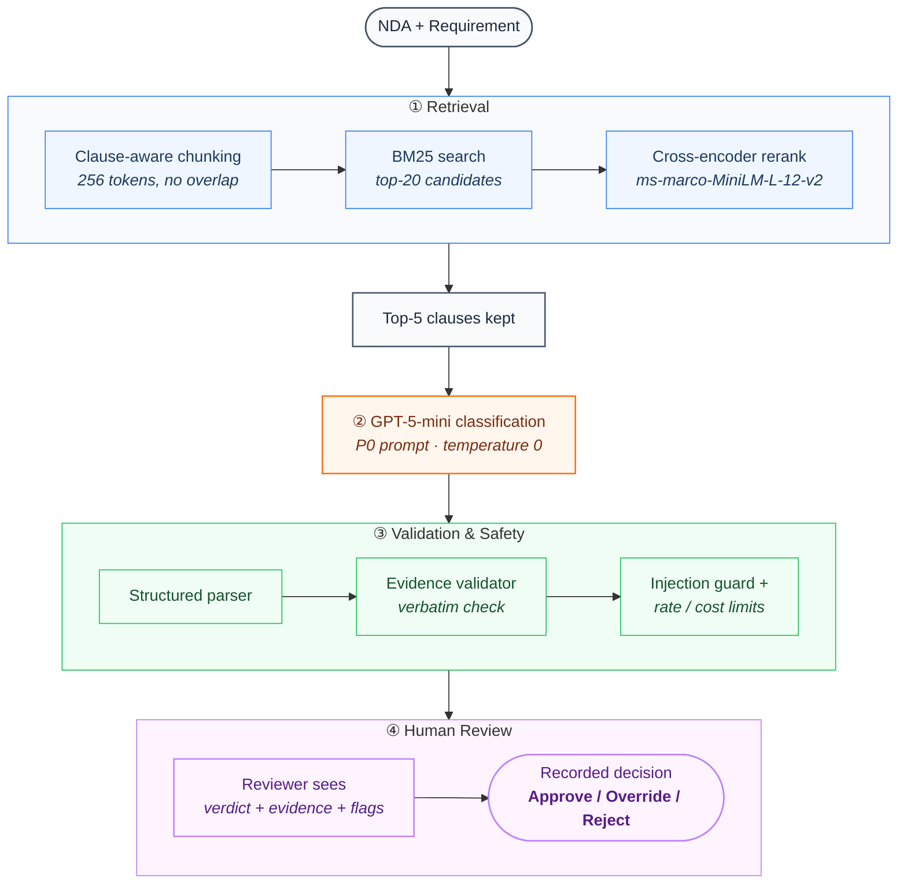
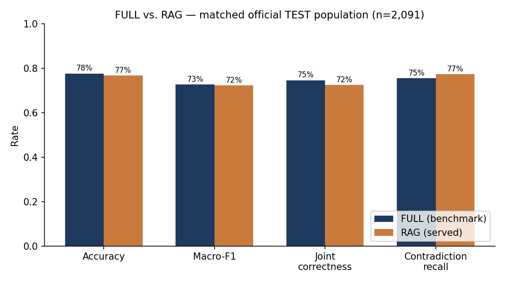
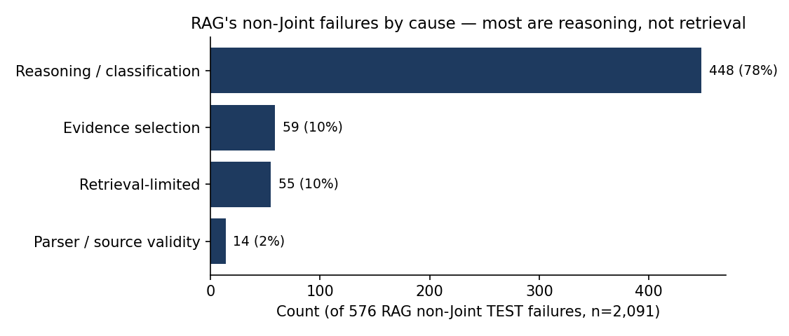
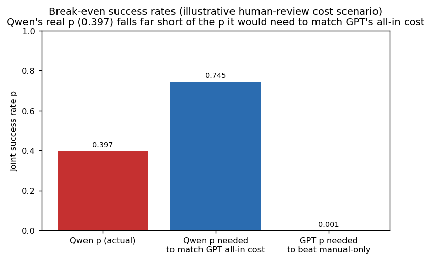

<div align="center">

# NDATrace

### Evidence-grounded NDA requirement review, with the human kept in the loop


[Problem](#the-problem) · [Baseline → final](#the-baseline-and-how-far-we-moved-it) · [Persona](#the-persona) · [Data](#the-data) · [Flow](#how-data-flows) · [Architecture rationale](#why-rag-not-full-or-an-agent) · [Results](#key-results) · [Business impact](#business-impact) · [Experiments](#experiments-what-we-tested-and-why) · [Run it](#quick-start) · [Reproduce](#reproducibility) · [Limitations](#responsible-ai-and-limitations) · [Deliverables](#project-deliverables)

</div>

---

> ### "It got the right answer without finding the right clause."
>
> That's the failure plain accuracy hides — and exactly why this project doesn't report accuracy
> alone. **Joint correctness** (label *and* cited evidence both right) is the headline number:
>
> | | Accuracy (label only) | **Joint correctness (label + evidence)** |
> | --- | ---: | ---: |
> | FULL | 77.6% | **74.6%** |
> | RAG (served) | 76.8% | **72.5%** |
>
> On ~3–4 points of every 100 cases, the model names the right label but can't back it with the
> right clause — invisible to accuracy, caught here because evidence is checked, not assumed.
> Full detail: [Key results](#key-results).

---

## The problem

- Legal operations teams check every incoming NDA against a fixed checklist of confidentiality
  requirements before it goes to a lawyer.
- Relevant language is often **paraphrased**, **qualified by an exception**, or **scattered**
  across clauses — a keyword search misses it.
- A generic LLM answer doesn't fix this: it can sound right with no way to check *which part of
  the document* it's based on.
- Vendor survey data (LegalOn Technologies, 2025, n=286 — cited as vendor research, not
  independently verified) reports organizations handling 101–1,000 contracts/year commonly spend
  2–4 hours per review. This motivates the problem; it is not evidence about NDATrace itself.

## The baseline, and how far we moved it

Working the baseline up, not assuming a sophisticated architecture was needed — the whole project
is organized around this progression:

| | Rule baseline (start) | FULL-context LLM | **RAG (served)** |
| --- | ---: | ---: | ---: |
| Accuracy | 59.0% | 77.6% | 76.8% |
| Joint correctness | 50.1% | **74.6%** | 72.5% |
| Cost / case | $0 | $0.00202 | **$0.00168** |

- **Started from a $0, zero-ML keyword baseline** (E04) — deliberately, to earn the right to add
  complexity rather than assume it.
- Moving to an LLM lifted Joint correctness **+24.5 points** (50.1% → 74.6%, FULL) — the single
  biggest jump in the whole project.
- RAG trades **2.1 Joint points** for **50% fewer input tokens** and bounded context — the
  system shipped, not the highest-scoring one (full story: [Why RAG, not FULL or an agent](#why-rag-not-full-or-an-agent)).
- Full baseline-to-final detail: [Key results](#key-results) · [Experiments table](#experiments-what-we-tested-and-why).

## What NDATrace is

A reviewer-assistance prototype that checks an NDA against standard confidentiality requirements
and shows the clause behind each verdict — **not** an autonomous legal decision-maker.

- Built and evaluated on [ContractNLI](https://stanfordnlp.github.io/contract-nli/), a public NDA
  benchmark — not a claim of performance on real confidential enterprise contracts.

## What it does

| Step | Detail |
| --- | --- |
| **Input** | An NDA (pasted or uploaded) + one or more of 17 fixed confidentiality requirements. |
| **Retrieve** | Find the clauses most likely relevant to each requirement. |
| **Classify** | Entailment / Contradiction / Not Mentioned, with a short explanation. |
| **Validate** | Cited evidence must appear verbatim in the NDA — no paraphrased "evidence." |
| **Flag** | Low source-validity or suspected prompt injection → routed for human review. |
| **Output** | Per requirement: label + explanation + the exact cited clause + any review/security flags — shown to the reviewer, nothing auto-finalized. |
| **Record** | Reviewer clicks Approve / Override / Reject, with an optional note — persisted. |

## The persona

**Tina — legal operations analyst, not a lawyer.**

- Receives a vendor NDA, must check it against her company's standard confidentiality checklist.
- Doesn't know in advance which clause, exception, or cross-reference matters for which
  requirement.
- **Today:** reads the whole NDA clause by clause to be sure nothing was missed.
- **With NDATrace:** gets a verdict per requirement, each with its supporting clause, reviews the
  flagged/uncertain ones first, and records her decision.
- She is never asked to trust the system — she's shown what it's based on.

> This is a persona scenario illustrating the workflow, not a measured time-and-motion study — no
> review-time or productivity claim is made here (see [Business impact](#business-impact)).

## The data

[ContractNLI](https://stanfordnlp.github.io/contract-nli/) (Koreeda & Manning, EMNLP 2021 Findings) — public, CC BY 4.0.

| | |
| --- | --- |
| NDAs | 607 |
| Fixed requirements (hypotheses) | 17 |
| Document × requirement examples | 10,319 |
| Labels | Entailment / Contradiction / NotMentioned |
| TEST split used for all headline results | 2,091 examples, 123 documents |
| Gold evidence | Span-level, provided for Entailment/Contradiction |

- Gold labels and evidence are **withheld from the model** at inference time, scored only
  afterward.
- The TEST split was **not tuned against** within this project's own development process — a
  superseded earlier run did score it once before, disclosed in
  [`docs/data_contamination_register.md`](docs/data_contamination_register.md). Not described as
  "blind."

## How data flows



- No agent and no automatic confidence gate — both tested, neither deployed (see
  [Why RAG, not FULL or an agent](#why-rag-not-full-or-an-agent)).
- Verified against `pipeline/frozen_rag.py` (`CHUNK_SIZE=256`, `CANDIDATE_POOL_SIZE=20`,
  `TOP_K=5`), `pipeline/final_review.py` (`temperature=0.0`).

## Why RAG, not FULL or an agent

Four architectures were built and measured against each other, not assumed:

| Alternative | Verdict |
| --- | --- |
| Rule-based keyword baseline | 59.0% accuracy / 50.1% Joint — insufficient, justified an LLM |
| Full-context LLM (**FULL**) | Strongest measured quality — kept as the benchmark reference |
| Retrieval-augmented generation (**RAG**) | Bounded cost/context — **kept as the served architecture** |
| Selective agentic investigation | Zero tool calls used on 15 real escalated cases, net benefit 0.0pp — **rejected** |

- Automatic confidence-routing was also tested (E15) — no policy hit both an acceptable review
  workload and an acceptable error rate, so every result routes to a human instead.
- Full experiment table: [Experiments: what we tested and why](#experiments-what-we-tested-and-why).

**Key trade-offs made, explicitly:**

- **Quality for cost/scale:** picked RAG knowing FULL scores higher (2.1 Joint points) — bet that
  bounded context matters more at real document lengths than on ContractNLI's short (median
  1,836-token) NDAs.
- **Simplicity for capability:** rejected the agent and auto-routing after measuring them, not
  before — both added real cost and earned nothing back on this data.
- **Precision for recall:** BM25 + reranker over dense/hybrid retrieval — tied on quality,
  BM25 needs no vector index to operate or maintain.

**What I owned, end to end:** the retrieval/reranking pipeline and its chunking strategy, the
evaluation harness and all 24 experiment scripts, the reviewer decision API
(`backend/routes/review.py`, `review_decisions` table), the injection guard, and the
reproducibility harness (`scripts/verify_reproducibility.py`) that checks this repo's own claims.

## Key results

> **All numbers on this page are measured**, from saved model predictions — none are projected or
> modeled. Modeled/projected figures live only in [Business impact](#business-impact), labeled as
> such, so the two are never confused.

### Metrics: targeted vs. reached

| | Metric | Target (proposal) | Reached (measured) | Status |
| --- | --- | --- | --- | --- |
| Primary | Risk-sensitive recall gain, RAG over FULL (mean of Contradiction + NotMentioned recall) | ≥ 5.0 points | +1.2 points (69.07% → 70.25%) | ❌ **Not met** |
| Secondary | Joint correctness (label + evidence), reported alongside accuracy | No fixed target — required to be measured and disclosed | 74.6% (FULL) / 72.5% (RAG), n=2,091 | ✅ Measured, both reported |
| Secondary | Contradiction recall, the risk class that matters most | No fixed target — required to be reported separately, not averaged away | 75.5% (FULL) / 77.3% (RAG) | ✅ Measured, reported separately |

Reported as measured, not reframed around a friendlier number — full context below.

Official ContractNLI **TEST** split, **n = 2,091**, FULL and RAG on the identical population with
paired significance testing. Source: `experiments/E20_final_rag_test/results/E20_final_report.json`.



> **Baseline:** Rule-based keyword matching ($0, no ML) · **Metric:** Accuracy, Macro-F1, Joint
> correctness, Contradiction recall · **Dataset:** ContractNLI TEST, n=2,091 · **Takeaway:** an LLM
> (FULL or RAG) clears the rule baseline by ~20+ points on every metric; FULL and RAG are close to
> each other, with FULL ahead on Joint correctness specifically.

| Metric | Rule | Qwen (local) | FULL | RAG (served) |
| --- | ---: | ---: | ---: | ---: |
| Accuracy | 59.0% | 49.9% | **77.6%** | 76.8% |
| Macro-F1 | 0.479 | 0.431 | **0.727** | 0.723 |
| Joint correctness | 50.1% | 39.7% | **74.6%** | 72.5% |
| Contradiction recall | 16.8% | 25.5% | 75.5% | **77.3%** |
| Input tokens / case | — | — | 2,279 | **1,131** |
| Cost / case | $0 | $0 | $0.00202 | **$0.00168** |

- **Joint correctness** = label *and* cited evidence both correct — the metric that actually means
  "evidence-grounded."
- **FULL's Joint advantage over RAG is statistically real** (McNemar p=0.0047); accuracy is not
  significantly different (p=0.217).



> **Baseline:** none — a breakdown of RAG's own errors, not a comparison · **Metric:** failure
> cause, as a share of all non-Joint failures · **Dataset:** ContractNLI TEST, n=2,091 (576
> failures) · **Takeaway:** 78% of RAG's failures are reasoning errors on evidence it already
> retrieved — better retrieval alone would not fix most of this.

- Retrieval is **not** the bottleneck — only 10% of RAG's failures are retrieval-limited; 78% are
  reasoning/classification errors on evidence the system already found.
- [`docs/failure_analysis.md`](docs/failure_analysis.md) — the full breakdown and what it implies
  for future work. [`examples/case_success/`](examples/case_success/) and
  [`examples/case_failure/`](examples/case_failure/) walk one real correct case and one real
  failure case, step by step, through every pipeline stage.

## Business impact

> **Everything below this line is a modeled scenario, not a measurement** — the opposite of
> [Key results](#key-results) above. Kept in its own section deliberately, so the two are never
> read as the same kind of claim.

- **This is a reviewer-assistance tool: every result still requires human verification.** No
  review-time or labor-savings number is measured or claimed.
- Measured AI cost (the one real number here): **$0.00168/case** (RAG). That is not total
  workflow cost.
- Under one illustrative human-review scenario, AI-assisted review beats manual-only review at
  essentially any positive success rate:



> **Baseline:** manual-only review (no AI assistance) · **Metric:** Joint success rate needed to
> break even on cost · **Dataset:** scenario inputs only — $3.33/case human-review cost (5 min at
> $40/hr, **assumed, not measured**) · **Takeaway:** GPT clears this break-even bar at ~0.1%
> success; the local Qwen baseline, at its real measured 39.7%, does not clear the bar it would
> need (74.5%) to match GPT's all-in cost.

- All business figures are explicitly labeled **MODELED scenarios** in the app and in
  [E18](experiments/E18_business_course_synthesis/summary.md) — not realized production savings.
- Security remediation turned 2 of 2 OWASP LLM Top 10 baseline failures into 1 PASS + 1 PARTIAL
  (full detail: [Responsible AI and limitations](#responsible-ai-and-limitations)).

## Experiments: what we tested and why

Twenty-four numbered experiments (E00–E23) back every claim above; these are the decisive ones:

| Experiment | Question | Finding | Decision |
| --- | --- | --- | --- |
| Rule baseline (E04) | Does keyword matching suffice? | 59.0% accuracy / 50.1% Joint, n=2,091 | Insufficient; justified an LLM |
| Oracle (E01) | Model or retrieval bottleneck? | 90.6% macro-F1 given gold evidence (n=300) | Model not the bottleneck |
| Prompt selection (E03) | Which prompt classifies best? | Minimal (P0) beat elaborated prompts | Froze P0 |
| Retrieval optimization (E06) | Does dense/hybrid beat BM25? | All converge to ~92% Recall@5 once reranked | Froze BM25 + reranker |
| Matched FULL vs RAG (E17/E20) | Does RAG match FULL's quality? | FULL wins Joint (p=0.0047) | Kept RAG for cost/scaling; gap disclosed |
| Selective agent (E11) | Do extra tools recover mistakes? | Zero tool calls; net Joint benefit 0.0pp | Rejected |
| Auto review-routing (E15) | Can the system self-flag uncertainty? | No policy hit both workload and error targets | Rejected |
| Injection guard live check (E23) | Does the guard hold on a real call? | Model refused; guard fired correctly | Confirms E16/E22 |

Full ledger: [experiment registry](docs/experiment_registry.md). Interactive version in the app at
`/project`.

## Quick start

**Requirements:** Python 3.12 · Node.js ≥20.9 + npm · internet access (dataset + model downloads).
An OpenRouter API key is needed **only** for billed review calls.

```bash
# 1. Clone
git clone https://github.com/AsmithaUbaid/ndatrace.git && cd ndatrace

# 2. Python environment
python3.12 -m venv .venv && source .venv/bin/activate
python -m pip install -r requirements.txt

# 3. Configure
bash scripts/download_data.sh     # downloads + checksum-verifies ContractNLI
cp .env.example .env              # safe placeholders, no key required to start
python scripts/verify_environment.py

# 4. Backend
uvicorn backend.app:app --reload  # http://localhost:8000

# 5. Install frontend dependencies (new terminal)
cd frontend && npm ci

# 6. Start the frontend
npm run dev                       # http://localhost:3000

# 7. Open http://localhost:3000

# 8. Run automated tests (zero paid calls)
cd .. && pytest
cd frontend && npx tsc --noEmit && npm test && npm run build
```

- `GET /health` works without a key. Review endpoints return a clear config error until
  `OPENROUTER_API_KEY` is set.
- Prefetch the two public reranker/embedding models with `python scripts/download_models.py`.

## Reproducibility

| | Cost | What it proves |
| --- | --- | --- |
| **A. Reproduce metrics from saved outputs** | Free, no API key | Every number in this README is recomputed from committed predictions, not re-run against a live model. |
| **B. Run one real request through the live pipeline** | Free (stub), or ~$0.002 (`--live`, one real call) | The actual production code path — chunk → retrieve → rerank → classify → validate — works end to end on a real input, not just that saved numbers recompute. |
| **C. Rerun live inference experiments at scale** | Real API cost | Not part of normal verification; not done casually. |

**One command covers (A) end to end:**

```bash
source .venv/bin/activate
python scripts/verify_reproducibility.py
```

This actually runs and asserts (exits non-zero on failure):

1. Dataset present, SHA-256 checksum-verified.
2. Full `pytest` suite (433 tests, $0).
3. Every offline script that recomputes metrics from saved predictions.
4. `git diff --exit-code` on everything those scripts write — byte-for-byte reproduction, not just
   "didn't crash."
5. The real FastAPI backend, in-process — `/health`, `/hypotheses`, `/experiments`,
   `/experiments/e20` all asserted to return real, correctly-shaped data.

<details>
<summary>Sample output</summary>

```text
============================================================
REPRODUCIBILITY CHECK SUMMARY
============================================================
  [PASS] 1. Dataset present and checksum-verified
  [PASS] 2. Full test suite (zero paid calls)
  [PASS] 3. Offline analysis scripts recompute without error
  [PASS] 4. Recomputed results match committed files exactly (git diff --exit-code)
  [PASS] 5. Backend serves real computed data (in-process, no paid calls)
============================================================
ALL CHECKS PASSED
```

</details>

**One command covers (B) — one real NDA through the real pipeline:**

```bash
python experiments/E00_smallest_slice/run_smallest_slice.py          # dry-run, $0, no network
python experiments/E00_smallest_slice/run_smallest_slice.py --live   # one real hosted call, ~$0.002
```

This is not a saved-output replay: it calls `pipeline/frozen_rag.py` and `pipeline/final_review.py`
directly — the same functions the backend calls — and prints a complete, real result.

<details>
<summary>Sample output (dry-run)</summary>

```json
{
  "label": "Entailment",
  "evidence": [
    "shall not disclose the Confidential Information to any third party without the prior written consent of the Disclosing Party."
  ],
  "explanation": "The quoted clause(s) above support this requirement.",
  "source_valid": true,
  "needs_human_review": false,
  "model": "openai/gpt-5-mini",
  "success": true
}
Smallest slice: PASS
```

</details>

- [Experiment registry](docs/experiment_registry.md) · [Evaluation protocol](docs/evaluation_protocol.md) · [Architecture decisions](docs/architecture_decisions/INDEX.md) · [Data contamination register](docs/data_contamination_register.md)
- [Technical Tour notebook](notebooks/NDATrace_Complete_Technical_Tour.ipynb) — executable, saved artifacts by default, zero hosted calls.
- Historical T-series materials pre-date this architecture and were removed in a later cleanup
  pass (see `git log`) — no current number is computed from them.

## See NDATrace in action

> **Screenshots pending** — placeholders mark exactly what should go here.

| Placeholder | Should show |
| --- | --- |
| `docs/screenshots/01-input.png` | NDA pasted/uploaded, requirements selected |
| `docs/screenshots/02-results.png` | Verdicts with cited evidence |
| `docs/screenshots/03-decision.png` | Approve / Override / Reject recorded |

No demo video exists yet; none is linked here until one does.

## Repository map

```text
pipeline/      Frozen RAG runtime: chunking, retrieval, reranking, parsing, validation
backend/       FastAPI endpoints, persisted review history, reviewer decision API
frontend/      Next.js reviewer interface and Project Story
evaluation/    Metrics, evaluators, schemas, and harnesses
experiments/   Frozen E00–E23 protocols, outputs, and analyses
notebooks/     Executable Technical Tour (saved artifacts by default)
data/          Public-dataset instructions and tracked regression fixtures
results/       Canonical cross-experiment result tables
scripts/       Setup, offline analysis, experiment, and report utilities
docs/          Architecture, evaluation protocol, ADRs, experiment registry, images
tests/         Unit, integration, robustness, and leakage checks
reports/       Final report (draft) and a preserved earlier trade-off draft
```

## Responsible AI and limitations

| Distinction | What's actually true here |
| --- | --- |
| Evidence-source verification | Cited text checked to appear verbatim in the NDA. |
| Semantic classification correctness | Separate question — source-valid evidence ≠ correct label. |
| Prompt-injection detection | Partial, not solved — 4/11 tested attack patterns still bypass the guard (E16). |
| Human verification | Every result shown for review; nothing auto-finalizes. |
| Recorded reviewer decisions | Approve/Override/Reject is a real, persisted API call. |

- **No authentication** — scoped to public/synthetic NDA text only; not approved for confidential
  documents.
- ContractNLI is a public benchmark, not evidence of performance on long (50–100 page) real
  enterprise contracts.
- No production deployment, no production-readiness claim, no complete prompt-injection
  protection claim.

## Project deliverables

NTU PE6201 (Emerging AI Technologies) end-of-course project.

- **Trade-off report:** submitted separately, not included in this public repository ahead of the
  submission deadline.
- **GitHub implementation:** this repository, reproducible end to end via
  [`scripts/verify_reproducibility.py`](#reproducibility).
- **Problem statement / course materials:** submitted separately through the course platform.
- **Recorded demonstration:** not yet recorded.

NDATrace was developed for NTU PE6201 using the
[ContractNLI](https://stanfordnlp.github.io/contract-nli/) dataset. It is an evidence-grounded
reviewer-assist prototype, not legal advice or a production approval system.
