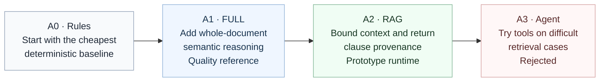
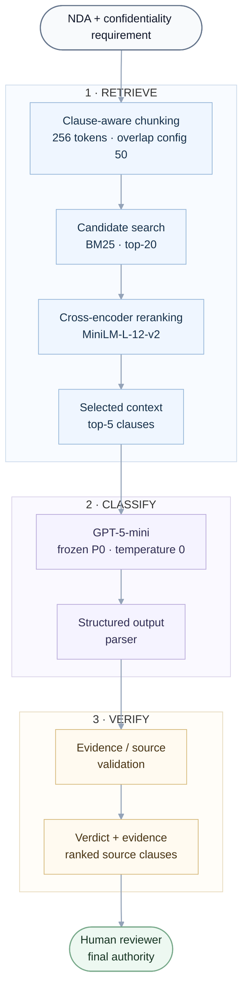

# NDATrace

**Evidence-grounded NDA requirement review for enterprise legal operations**

NDATrace is a reviewer aid for enterprise legal operations. Given an NDA and a confidentiality
requirement, it returns Entailment, Contradiction, or Not Mentioned together with the source
evidence a human can verify.

`Python` · `FastAPI` · `Next.js` · `GPT-5-mini` · `ContractNLI`

## Final decision at a glance

| Layer | Status |
|---|---|
| Rule baseline | Retained as the cheapest deterministic baseline |
| FULL-context GPT-5-mini | Strongest measured quality-reference configuration |
| Top-5 RAG | Retained interactive/prototype runtime |
| Selective agent | Tested and rejected |
| Human reviewer | Final authority on every verdict |

> **Headline metric: Joint = correct label AND correct supporting evidence.**
> A right label with unsupported evidence is not a successful result for a legal-review assistant.

Matched, same-population final TEST comparison (n=2,091, official ContractNLI TEST split; full
table and interpretation in [§ Headline evaluation](#headline-evaluation-joint)):

| | FULL | RAG top-5 |
|---|---:|---:|
| Joint | **74.6%** | 72.5% |

- Classification accuracy difference: McNemar **p = 0.217** — **not** statistically significant.
  FULL is not shown to classify more accurately than RAG.
- Joint difference: McNemar **p = 0.0047** — **statistically significant**. FULL's evidence-grounded
  advantage is real, not noise.

RAG is nonetheless the served runtime: it cuts classifier input context by 50.4% and gives every
result clause-level provenance, which fits the interactive reviewer workflow (see
[§ Business and technical trade-off](#business-and-technical-trade-off)).

## Problem, user, and scope

- **User:** an enterprise legal operations analyst reviewing NDAs against standard confidentiality
  requirements.
- **Problem:** whether an NDA satisfies a requirement can depend on paraphrases, definitions,
  exceptions, and cross-references — not a simple keyword match.
- **Output:** a label (Entailment / Contradiction / Not Mentioned) plus the specific source clauses
  a reviewer can check.
- **Intended use:** a reviewer aid that narrows attention to the relevant clauses.
- **Explicit non-use:** not legal advice; NDATrace does not autonomously approve or reject an NDA.
  The human reviewer remains the final authority.

## Every rung had to earn its complexity

The project began with the cheapest deterministic approach. Each additional layer had to justify
its quality, cost, latency, and failure modes before it could remain in the system.



| Rung | Architecture | What it added | Decision |
|---|---|---|---|
| A0 | Rules | Deterministic keyword baseline | Insufficient semantic coverage |
| A1 | FULL-context LLM | Semantic reasoning over the complete NDA | Strongest measured Joint result (quality reference) |
| A2 | RAG | Bounded context and clause provenance | Selected prototype runtime |
| A3 | Selective/full agent | Dynamic retrieval tools and additional reasoning steps | Rejected: no useful quality gain |

**A0 — Rules.** A conventional fixed classifier would be cheap at inference time, but the project
required semantic reasoning over paraphrases, exceptions, and evidence spans, so rules were
retained only as the non-AI floor, not as a candidate for production.

**A1 — FULL, and which model earns it.** Before optimizing anything downstream, the Oracle
experiment fed each candidate model gold evidence directly, separating reasoning quality from
retrieval quality. This is a diagnostic — its numbers must not be mixed with end-to-end final TEST
results.

| Model | Execution | Oracle Macro-F1 | Contradiction Recall |
|---|---|---:|---:|
| Llama 3.2 3B | Local | 0.601 | 25% |
| Qwen 2.5 7B Instruct | Local | 0.638 | 30% |
| Gemini 2.5 Flash Lite | Hosted | 0.867 | 71% |
| **GPT-5-mini** | Hosted | **0.906** | **82%** |

GPT-5-mini showed the strongest measured reasoning ceiling and powers every final hosted
comparison; Qwen was retained as the $0 local comparator for the full-TEST evaluation. Full
methodology: [`experiments/E01_oracle/summary.md`](experiments/E01_oracle/summary.md).

**A2 — RAG, and which retrieval design earns it.** BM25, dense (MPNet, BGE), and hybrid (BM25+dense
via Reciprocal Rank Fusion) candidate generators were compared. Before reranking, the generators
differed; once the same cross-encoder reranker was applied to all of them, BM25, dense, and hybrid
converged to essentially the same ceiling — a paired case-by-case comparison against the frozen
BM25+reranker config found agreement on 4,370 of 4,371 cases (exact binomial p=1.0, no evidence of
a real difference). BM25+reranker was retained by **parsimony** — it is the simplest generator that
performs equally well — not because BM25 is statistically superior. Full record:
[`experiments/E06_retrieval_optimisation/summary.md`](experiments/E06_retrieval_optimisation/summary.md).

**A3 — Agent, and why it did not earn its complexity.** The agent experiments tested whether
additional retrieval tools and controller steps could recover base RAG failures on a fixed
150-case TRAIN sample.

| Configuration | Joint | Cases using tools |
|---|---:|---:|
| Base RAG | **75.3%** | — |
| Agent V1 | 73.3% | 1.3% |
| Agent V2 controller prompt | 68.7% | 20.0% |

Changing the controller prompt increased tool use substantially, but produced no useful
tool-mediated recoveries — quality got worse, not better. The tested retrieval-agent configuration
therefore **did not earn its added complexity**. This is a finding about the tested design, not a
claim that agentic architectures cannot work elsewhere. Full record:
[`experiments/E09_agent_justification/`](experiments/E09_agent_justification/),
[`experiments/E10_agent_design/`](experiments/E10_agent_design/),
[`experiments/E11_selective_agent_evaluation/`](experiments/E11_selective_agent_evaluation/).

> **Key finding:** more architectural complexity was retained only when it produced measurable
> value; more autonomy did not automatically improve quality, and the agent did not earn its keep.

## Final prototype architecture



Both the single-requirement and batch-review endpoints use the same frozen pipeline. The batch
path builds one document index and reuses it across the selected requirements. There is **no
agent, no automatic confidence router, no rule boost, and no silent FULL-context fallback** in the
runtime — every request is served by the bounded-context RAG path shown above, with the same
BM25 candidate generator selected in [§ Every rung had to earn its complexity](#every-rung-had-to-earn-its-complexity)
(no dense/FAISS retrieval in the current runtime).

| Component | Frozen choice |
|---|---|
| Chunking | Clause-aware, 256-token limit |
| Overlap | 50 in the frozen configuration; clause-aware chunking preserves boundaries rather than sliding windows |
| Candidate retrieval | BM25 top-20 |
| Reranker | `cross-encoder/ms-marco-MiniLM-L-12-v2` |
| Final context | Top-5 clauses |
| Model | `openai/gpt-5-mini` |
| Prompt | Frozen `GPT-P0` |
| Temperature | 0 |
| Agent | Not used |
| Routing | Not used |

Implementation details: [`docs/architecture.md`](docs/architecture.md).

## Headline evaluation: Joint

NDATrace evaluates three distinct questions, and treats only the third as the headline measure:

| Measure | Question |
|---|---|
| Accuracy | Was the label correct? |
| Evidence quality | Did the system identify the correct source clause? |
| **Joint** | Were **both** the label and evidence correct? |

Evaluation combines deterministic schema/source checks with ContractNLI's human-annotated labels
and evidence — Joint success requires both a correct label and valid supporting evidence, not
just a plausible-sounding one.

**Protocol.** ContractNLI's official TRAIN/DEV/TEST partition was preserved with no re-splitting.
TRAIN supported development and ablations; DEV supported architecture selection. The official TEST
split was not accessed during reconstruction-v2 tuning — model, prompt, retrieval, routing, agent
policy, and scoring configuration were frozen before final TEST runs, and gold labels/evidence were
hidden from inference. This is described as the final held-out evaluation **under the
reconstruction-v2 protocol**, not as perfectly unseen data: earlier pre-reconstruction work had
historical TEST exposure that reconstruction-v2 did not reuse to tune the final system. Full
detail: [`docs/evaluation_protocol.md`](docs/evaluation_protocol.md),
[data contamination register](docs/data_contamination_register.md).

**Final comparison** — all 123 NDAs, 2,091 document–hypothesis cases in the official ContractNLI
TEST set. FULL and RAG used the same GPT-5-mini model, frozen P0 prompt, parser, and evidence
evaluator; only the supplied context differed.

| Metric | FULL | RAG top-5 |
|---|---:|---:|
| Accuracy | **77.6%** | 76.8% |
| Macro-F1 | **0.727** | 0.723 |
| Joint | **74.6%** | 72.5% |
| Contradiction Recall | 75.5% | **77.3%** |
| Evidence Recall | **93.3%** | 89.0% |
| Source Validity | 98.0% | **99.2%** |
| Mean input tokens | 2,279 | **1,131** |
| Mean latency | 7.31s | **7.14s** |

- Classification accuracy difference: McNemar **p=0.217** (not significant).
- Joint difference: McNemar **p=0.0047** (significant).

FULL is the stronger evidence-grounded quality-reference configuration. RAG has similar classification
quality but a lower, statistically real Joint rate, while cutting classifier input context by
50.4%. The product decision therefore trades some Joint quality for bounded context and provenance
— see [§ Business and technical trade-off](#business-and-technical-trade-off).

## Evidence map

Each row lets a marker jump from a claim in this README to the experiment that produced it.

| Decision / question | Evidence |
|---|---|
| Why keep a rule baseline? | [`experiments/E04_rule_baseline/`](experiments/E04_rule_baseline/) |
| Which model has the strongest reasoning ceiling? | [`experiments/E01_oracle/`](experiments/E01_oracle/) |
| Which retrieval design? | [`experiments/E06_retrieval_optimisation/`](experiments/E06_retrieval_optimisation/) |
| Which prompt? | [`experiments/E12B_gpt_prompt_optimization/`](experiments/E12B_gpt_prompt_optimization/), [`experiments/E12C_gpt_prompt_confirmation/`](experiments/E12C_gpt_prompt_confirmation/) |
| FULL or RAG? | [`experiments/E13_gpt_context_architecture/`](experiments/E13_gpt_context_architecture/), [`experiments/E20_final_rag_test/`](experiments/E20_final_rag_test/) |
| Keep an agent? | [`experiments/E09_agent_justification/`](experiments/E09_agent_justification/), [`experiments/E10_agent_design/`](experiments/E10_agent_design/), [`experiments/E11_selective_agent_evaluation/`](experiments/E11_selective_agent_evaluation/) |
| Automatic review routing? | [`experiments/E15_review_routing/`](experiments/E15_review_routing/) |
| Security limitations? | [`experiments/E16_robustness_security/`](experiments/E16_robustness_security/) |
| Cost-to-serve? | [`experiments/E18_business_course_synthesis/`](experiments/E18_business_course_synthesis/) |
| Final held-out TEST result? | [`experiments/E17_final_test/`](experiments/E17_final_test/), [`experiments/E17B_full_test_completion/`](experiments/E17B_full_test_completion/) |

The full experiment ledger for E00–E20 is indexed in
[`docs/experiment_registry.md`](docs/experiment_registry.md).

## Business and technical trade-off

RAG's raw inference cost is lower than FULL's: 50.4% fewer input tokens and 16.8% less API cost
per case in the matched E20 comparison. But raw API cost is not the same as cost-to-serve.
NDATrace's modeled cost-to-serve formula (`C_month = V·[C_AI + (1−p_safe)·C_H] + F`, where
`p_safe` is Joint success — the automatically-handled-correctly rate, not classification accuracy)
treats every non-Joint case as falling back to human review. Under that model, GPT-5-mini + FULL's
measured all-in cost is **$0.8485/case** — far below manual-only review (**$3.33/case**) and below
local Qwen's all-in cost even though Qwen has $0 API cost, because Qwen's lower Joint success
(39.7%) sends far more cases to the modeled human-review fallback. Full model and figures:
[`experiments/E18_business_course_synthesis/summary.md`](experiments/E18_business_course_synthesis/summary.md)
(§7, Cost-to-serve).

E18 was synthesized before RAG's full-TEST Joint number existed, so the repo does not contain an
independently computed RAG all-in cost-to-serve figure. But the same formula implies the direction
of the trade-off: RAG's Joint is 2.2 points lower than FULL's, and the modeled human-review cost
(`C_H`) is far larger per case than the sub-cent difference in AI inference cost — so a small Joint
gap is *expected* to matter more to total cost-to-serve than a small inference-cost saving does.

> At the modeled human-review fallback cost, FULL can plausibly be cheaper overall despite higher
> inference cost, because its higher Joint rate is expected to reduce manual rework. This is a
> **modeled, directional** implication of E18's cost formula, not a realized saving or an
> independently computed RAG figure.

**Product decision:** RAG is retained as the runtime because bounded context, reusable per-document
retrieval indexing, and clause-level provenance fit the interactive reviewer workflow. FULL is
retained as the quality reference because it has the higher measured Joint. `C_H`, `V`, and `F`
are explicit scenario variables in E18 — NDATrace has no verified enterprise human-review cost, so
all dollar figures here are modeled/expected, not realized.

## Failure analysis

E20 recorded 576 non-Joint outcomes on the full TEST set:

| Failure category | Cases |
|---|---:|
| Reasoning/classification | 448 |
| Evidence selection | 59 |
| Retrieval-limited | 55 |
| Runtime/parser/source validity | 14 |

Most remaining failures are reasoning/classification failures, not retrieval failures. Retrieval
was already at its converged ceiling (see A2 above), so simply adding more retrieval actions was
unlikely to fix the dominant remaining problem — this is a second, independent line of evidence
(alongside A3's own results) supporting the agent rejection.

## Security, responsible use, and limitations

| Risk | Current control | Remaining gap |
|---|---|---|
| Unsupported / hallucinated evidence | Evidence/source validator checks that quoted evidence is a verbatim substring of the retrieved source text; source-invalid results are flagged for human review | Source validation checks **grounding** (the quote exists in the document), not **semantic correctness** (whether the quote actually supports the label) |
| Prompt injection (OWASP LLM Top 10 — Prompt Injection) | Measured under a small controlled red-team test (E16); results surfaced for disclosure, not silently absorbed | E16: **4 of 11** adversarial/prompt-injection cases succeeded, including **2 label hijacks**; Joint fell from 85% (clean) to 75% (attacked). The system is evidence-grounded but not prompt-injection-hardened |
| Excessive agency (OWASP LLM Top 10 — Excessive Agency) | The tested agent path was **read-only** (5 read-only tools), bounded to max 3 steps / max 2 tool calls / a 60s wall-clock cap / a $0.01-per-escalated-case cost circuit breaker, with duplicate-call protection (E10/E11) | The agent is **not in the live runtime** — this risk is currently avoided by exclusion (rejected in A3), not by a hardened deployed control |
| Silent wrong verdict (overreliance) | Joint scoring and mandatory source validation surface likely-wrong results; the human reviewer is the final authority on every case | Automatic uncertainty/confidence-based review routing (E15) did not meet its reliability target and is **not active** — no automated policy currently flags a probably-wrong verdict for priority review |
| Confidential NDA handling | NDA text is sent only to the configured model provider per request | No authentication/authorization, rate limiting, upload/malware validation, secrets hardening, or enterprise retention/PII controls — the system is **not production-security-complete** |

E16 was run against the frozen GPT-5-mini + P0 **FULL** candidate on 20 matched clean/adversarial
pairs — a small controlled test, not a certification of the current RAG runtime or of security more
broadly. Source-valid evidence means the quote came from the document; it does not mean the quote
is trustworthy or semantically correct.

**OWASP LLM Top 10 (2025)**: all 10 categories were assessed in E21 using a mix of static,
deterministic-runtime, hosted-adversarial, and reused empirical evidence (E16, E20). This is a
project security evaluation, not an OWASP certification: **3 PASS, 5 PARTIAL, 2 FAIL, 0 NOT
APPLICABLE.** Real gaps found and disclosed: no auth on `GET /results`/`GET /review/{id}` (LLM02),
no enforced cost/rate/length ceiling on the live API (LLM10, FAIL), known CVEs in the Python
dependency tree (LLM03), and adversarial/repeated clauses reliably outranking genuine evidence in
retrieval (LLM04/LLM08). Controls that held: output-handling parsing/validation (LLM05), the
backend's architectural exclusion of any agent code (LLM06), and no system-prompt leakage found in
10 fresh adversarial attempts (LLM07). See `experiments/E21_owasp_llm_top10/summary.md` for the
full 10-row table, evidence, and remediation backlog. **E21's baseline itself is unchanged** — it
remains the frozen "before" record.

**E22 — targeted remediation verification**: E21's two FAILs were addressed with targeted,
deterministic controls and independently verified, not just documented. LLM01 (Prompt Injection):
a regex-based guard (`pipeline/injection_guard.py`) now flags instruction-override/fake-role-marker/
response-format-hijacking text in the retrieved context and fails **closed** to human review
(`security_review_required`) — it does not block the model call or claim to prevent the attack.
Targeted regression: **PARTIAL** (0/32 false positives, 5/5 correct on hosted confirmation
including the exact case that failed in E21, but only 4/11 on E16's more varied real attack corpus —
honestly reported, not rounded up). LLM10 (Unbounded Consumption): request length caps, a real
enforced cost/budget ceiling (`pipeline/cost_guard.py` — `settings.max_budget_usd` is now actually
read and checked, not just declared), and in-process rate/concurrency limits (`backend/rate_limit.py`).
Targeted regression: **PASS** (all 17 local checks, zero hosted calls for any rejected request).
LLM02 was left unremediated (PARTIAL, unchanged) and LLM03 got two low-risk dependency upgrades
(38→34 CVEs, still PARTIAL). **E21 found the weaknesses; E22 verifies the mitigations — this does
not mean "OWASP now passes."** See `experiments/E22_targeted_security_remediation/summary.md`.

**Other limitations**

- ContractNLI is a proxy dataset, not a complete enterprise legal playbook; only the requirements it
  represents are evaluated.
- Quality on documents beyond ContractNLI's observed lengths (median 1,836 / max 7,861 TEST tokens)
  is not established — this is not evidence that RAG scales better or worse on 50–100 page
  contracts.
- NDATrace does not provide legal advice or autonomously approve/reject agreements; human review
  remains required for every verdict.

## Build vs reuse

| Layer | Decision |
|---|---|
| Data | Reuse ContractNLI |
| Model | Rent GPT-5-mini through OpenRouter |
| Chunking and retrieval orchestration | Build |
| BM25 | Reuse `rank_bm25` |
| Cross-encoder | Reuse pretrained `ms-marco-MiniLM-L-12-v2` |
| Evidence validation | Build |
| Evaluation harness | Build |
| API and UI | Build |

Commodity capabilities were reused or rented; project-specific retrieval, validation, evaluation,
API, and reviewer workflow logic were built.

## Quick start

### 1. Install the backend

```bash
git clone https://github.com/AsmithaUbaid/ndatrace.git
cd ndatrace
git switch reconstruction

python3 -m venv .venv
source .venv/bin/activate
pip install -r requirements.txt
bash scripts/download_data.sh
```

The first live retrieval may download the cross-encoder model. Copy the environment template and
set `OPENROUTER_API_KEY` for live GPT-5-mini reviews:

```bash
cp .env.example .env
python scripts/verify_environment.py
uvicorn backend.app:app --reload
```

The API runs at `http://localhost:8000`.

### 2. Start the frontend

In a second terminal:

```bash
cd frontend
npm install
npm run dev
```

Open `http://localhost:3000`. Live reviews require hosted, billed OpenRouter inference. Unit and
integration tests mock model calls and do not require paid inference:

```bash
python -m pytest tests/
```

## Reproduce the decision journey

[`notebooks/NDATrace_Complete_Technical_Tour.ipynb`](notebooks/NDATrace_Complete_Technical_Tour.ipynb)
is the main evidence/reproduction walkthrough: rules, Oracle/model selection, retrieval design,
prompt ablations, FULL versus RAG, routing, agent experiments, cost-to-serve, security, and the
final architecture decision.

`RUN_HOSTED_MODEL=False` by default. In that mode, the notebook reuses stored experiment outputs,
recomputes chunking and retrieval locally, and makes **zero** hosted calls. Setting it to `True`
enables exactly one live, billed GPT-5-mini demonstration call.

## Repository structure

```text
pipeline/      Frozen RAG runtime, model gateway, parser integration, and the current (E10/E11)
               reconstruction-v2 selective-agent modules (not wired into the live backend)
backend/       FastAPI endpoints and SQLite-backed review history
frontend/      Next.js reviewer interface
evaluation/    Metrics, evaluators, schemas, and experiment harnesses
experiments/   Frozen reconstruction-v2 protocols, outputs, and analyses
notebooks/     Executable technical tour
docs/          Architecture, API, evaluation protocol, architecture-decision records, and
               experiment registry
tests/         Unit, integration, robustness, and data-leakage tests
```

`results/final/reconstruction_v2/` holds the canonical final-facing summaries; the experiment
directories under `experiments/` remain the authoritative raw sources. `results/final/legacy/` and
`results/archive/runs/` hold historical/pre-reconstruction artifacts, retained only because current
reproduction scripts and docs still cite them by path — they are **not** part of the final runtime
or the reconstruction-v2 result.

Useful entry points:

- [`docs/architecture.md`](docs/architecture.md) — current runtime and quality-reference/product decision
- [`docs/architecture_decisions/INDEX.md`](docs/architecture_decisions/INDEX.md) — architecture decision records
- [`docs/experiment_registry.md`](docs/experiment_registry.md) — reconstruction-v2 experiment ledger
- [`docs/api.md`](docs/api.md) — API contract
- [`frontend/README.md`](frontend/README.md) — frontend development guide

## Project context

NDATrace was developed for NTU PE6201 Emerging AI Technologies using the
[ContractNLI](https://stanfordnlp.github.io/contract-nli/) dataset. Historical and rejected paths
remain in the repository for reproducibility; they are not part of the active runtime.
