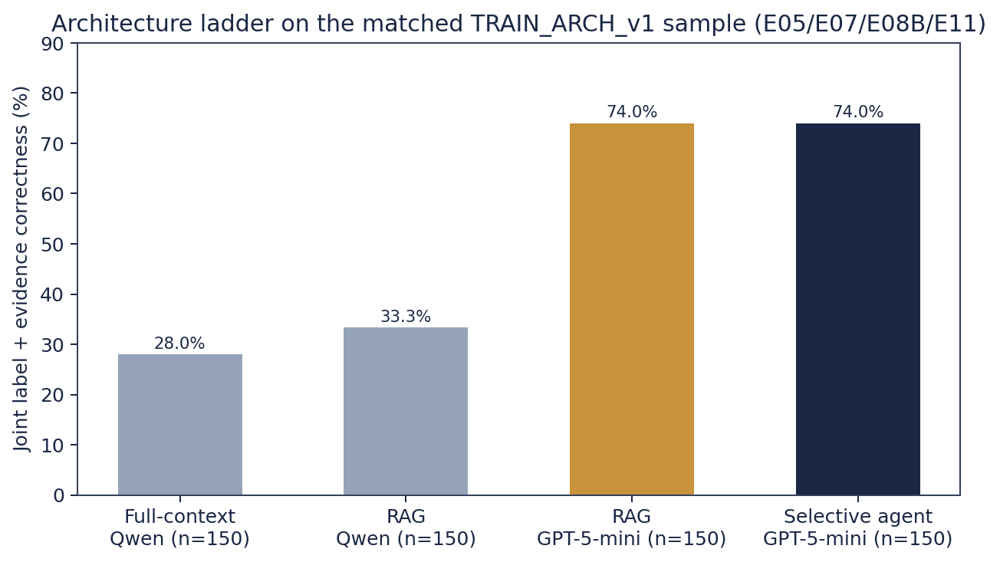
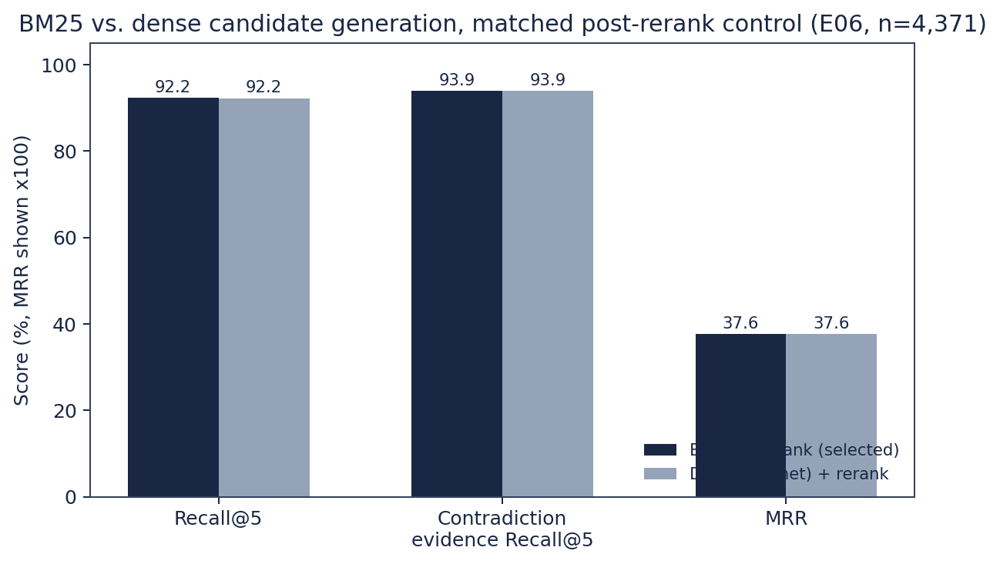
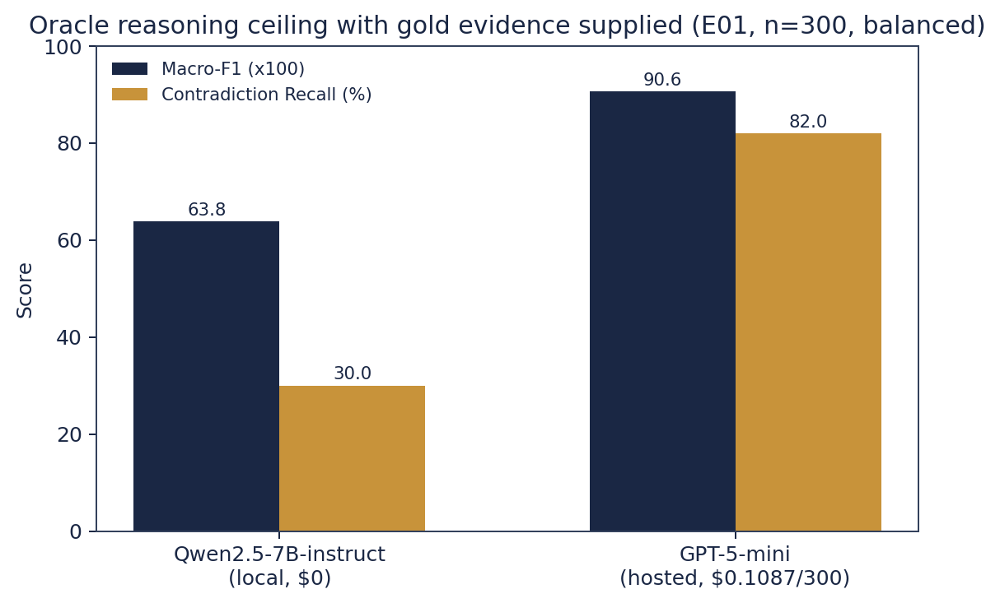
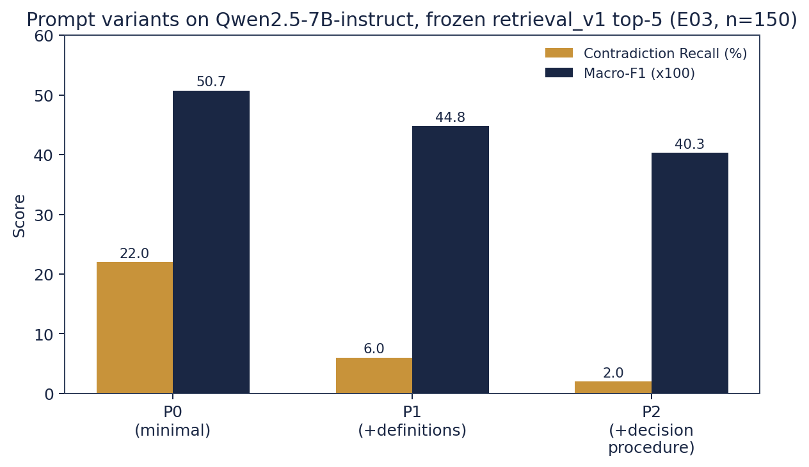
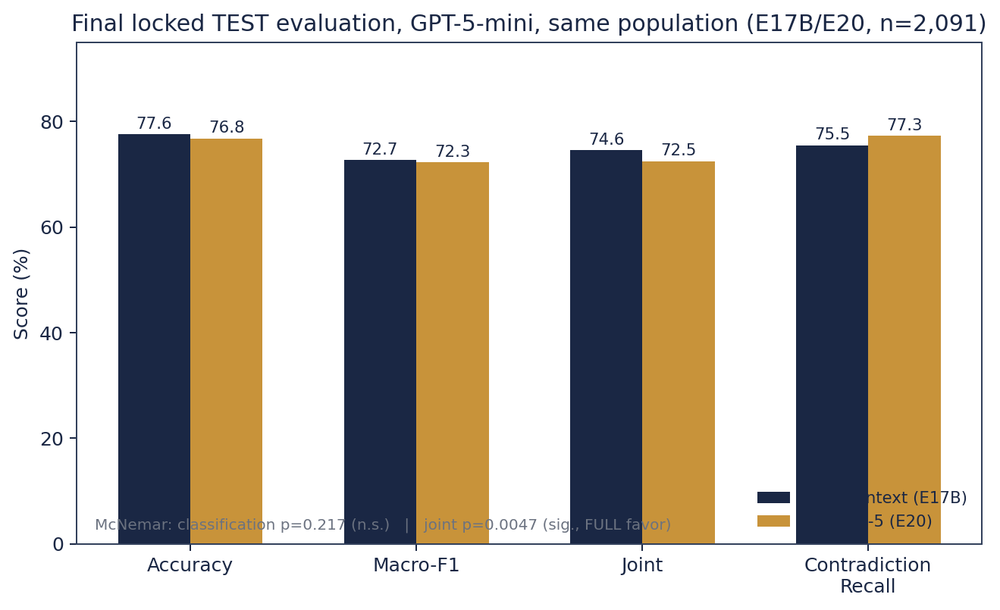
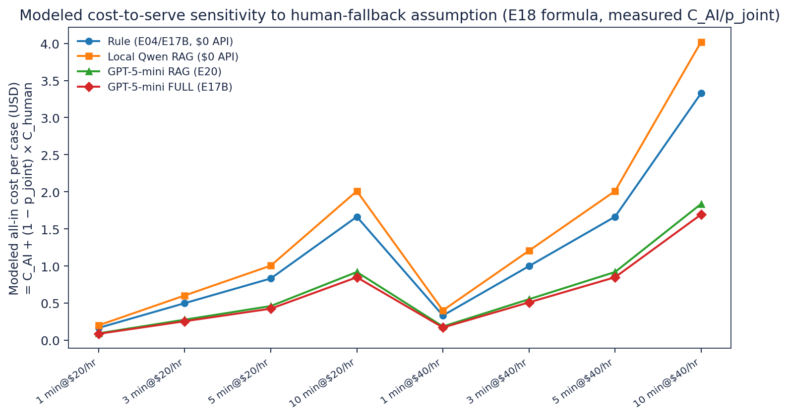
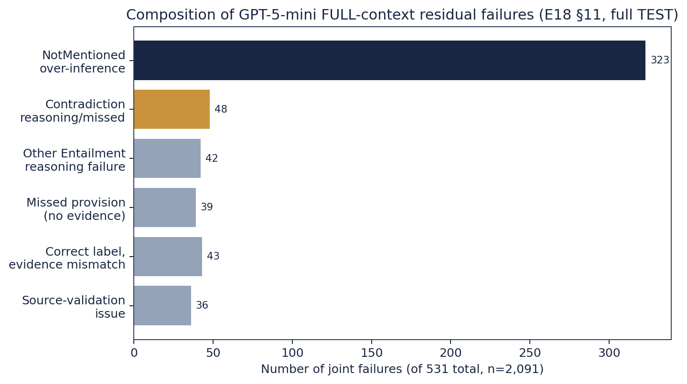
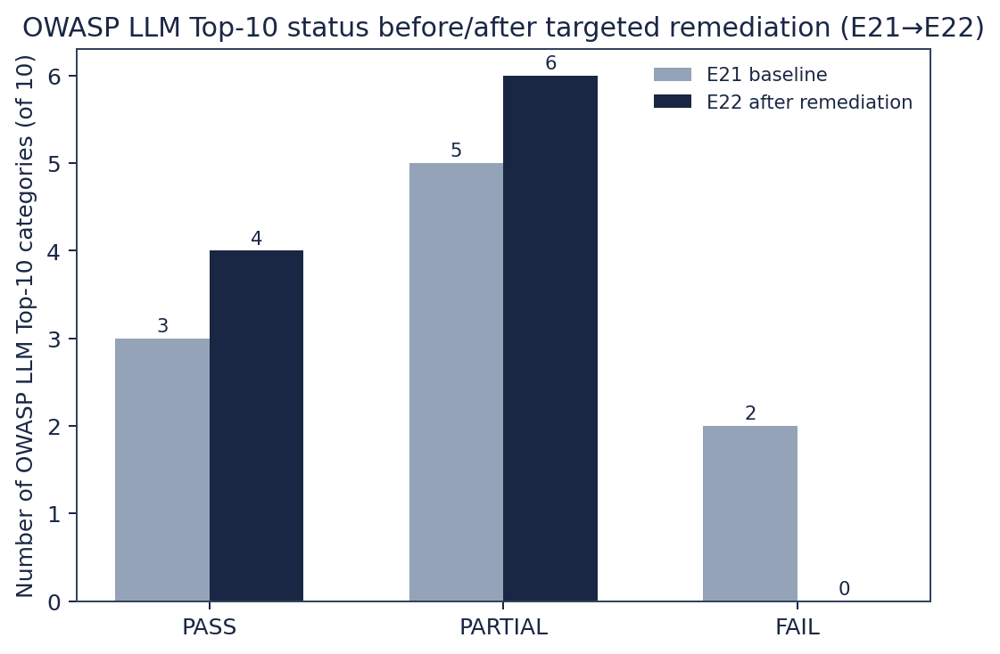

# NDATrace — Evidence-Grounded NDA Requirement Review

### Architecture trade-off report — reconstruction-v2, full official TEST split (n = 2,091)

I built NDATrace for a legal-ops analyst who has to check a signed NDA against a checklist of
confidentiality requirements — "does this NDA permit disclosure to affiliates," "is there a
survival clause," and so on — seventeen such requirements per document in this project's
ContractNLI-derived task. The system reads the NDA, classifies each requirement as **Entailment**
(the NDA supports it), **Contradiction** (the NDA conflicts with it), or **NotMentioned**, and
returns the exact clause text it relied on. The human reviewer remains the final authority; the
system's job is to make her checklist pass faster without hiding where an answer came from. I
judged every design decision below against five criteria, in this order: quality (does it get the
label right), evidence grounding (can she trust the citation), cost, latency, and complexity —
because every layer I added had to earn its place against a system that already worked without it.

This report replaces my earlier 1,200-word constrained version with the fuller evidentiary record
behind each decision: the tables, the figures, and — where the record supports it — the specific
cases that decided things. All numbers below are read directly from saved experiment artifacts
(`experiments/E*/`, `docs/experiment_registry.md`, `docs/architecture_decisions/INDEX.md`); none
were rerun or recomputed except the cost-sensitivity figure in Section 5, which I built by applying
E18's own published formula to its own published inputs and say so explicitly there.

---

## 1. The architecture ladder — why each rung had to earn its place

My working assumption going in was the usual RAG-project one: retrieval-augmented generation is
"the architecture," full-context is a wasteful baseline, and an agent on top makes it smarter
still. Reconstruction-v2 exists because I refused to accept that assumption without a matched
comparison, and the comparison overturned it twice.

**Table 1 — the architecture ladder, matched populations, evidence per rung**

| Rung | What it tests | Cost / complexity added | Evidence (this repo) | Verdict for NDATrace |
|---|---|---|---|---|
| **Rule baseline (A0)** | Is a $0 keyword matcher already competitive? | None — `pipeline/rule_baseline.py`, no model call | Full TRAIN (n=7,191): accuracy 56.8%, Macro-F1 0.471, Contradiction Recall 17.2% [14.8,19.9]. Full TEST (n=2,091): accuracy 59.0%, Joint 50.1%, Contradiction Recall 16.8%. High NotMentioned recall (92.2%) is mostly the default-to-NotMentioned fallback firing, not real detection (E04). | Kept as the $0 floor every other rung must clear by a wide margin, and as a routing-integrity signal later (E15 R1). Not competitive on Contradiction. |
| **Full-context LLM (A1)** | Does bypassing retrieval entirely change anything? | +1 LLM call/case, full document in context | `TRAIN_ARCH_v1` (n=150, matched to A2 below), Qwen2.5-7B-instruct: accuracy 40.0%, Macro-F1 0.397, Joint 28.0%, Contradiction Recall 28.0% (E05). | On the **weak local model**, full-context underperforms even the rule baseline on this metric — evidence that "give the model everything" is not free quality, at least not with a 7B model. |
| **RAG, retrieval_v1 (A2)** | Does bounding context to the top-5 reranked chunks help, hurt, or wash? | Retrieval index + BM25 + cross-encoder rerank | Same 150 cases, same Qwen model: accuracy 43.3%, Macro-F1 0.431, Joint 33.3%, Contradiction Recall 42.0% (+14.0pp over A1) (E07). McNemar overall p=0.542 (not significant); Contradiction-subset p=0.118. | A real, consistent, multi-metric directional gain over full-context on the weak model, **not yet significant at n=150** — the honest reading E07 gives it, not inflated. |
| **Model swap, same RAG (A2, stronger model)** | Is the *model* or the *architecture* the real lever? | $0.0017/case (GPT-5-mini via OpenRouter) vs. $0 local | Same 150 cases, only the model changed: accuracy 43.3%→**78.7%**, Joint 33.3%→**74.0%**, Contradiction Recall 42.0%→76.0%. McNemar p=5.24×10⁻⁹ (E08B). | **This is the single largest jump anywhere in the ladder** — 40.7pp of joint success, dwarfing every architecture-level change tested. It reframed the whole project: model selection, not RAG-vs-full-context, was the dominant quality lever. |
| **Selective agent (A3)** | Does a bounded 3-tool investigative loop recover the model's own residual failures? | +0-2 extra model calls on ~10% of cases, 3 frozen tools, hard step/time/token caps | Same 150 cases, GPT-5-mini: accuracy 78.7%→79.33% (+0.67pp), Joint 74.0%→74.0% (**unchanged**). 1 classification recovery / 0 regressions; 1 joint recovery / 1 joint regression, net zero (E11). The agent invoked its tools on **0 of 15** triggered cases — it concluded FINAL on step 1 every time. | **Rejected.** Confirms E09's independent diagnostic (only 1/39 of GPT's residual failures were genuinely dynamic-information cases) and E10's pre-declared no-go criteria. No quality gain for the added orchestration and latency. |

Figure 1 makes the shape of that finding visible in one picture: two architecture-level moves
(full-context→RAG, RAG→agent) produce single-digit joint-success deltas on this model, while the
model swap alone produces a 40-point jump.

*Figure 1. Joint label-and-evidence correctness across four architecture/model combinations on the
identical 150-case `TRAIN_ARCH_v1` sample (E05 full-context/Qwen, E07 RAG/Qwen, E08B RAG/GPT-5-mini,
E11 selective-agent/GPT-5-mini). The model swap (grey→gold) dwarfs every architecture-level change
tested (grey→grey, gold→navy).*

I retained RAG (not full-context) as the **serving** architecture once the model was fixed to
GPT-5-mini, for reasons the retrieval and final-TEST sections below lay out in full — but the
headline decision at this stage was: stop debating full-context vs. RAG vs. agent as if they were
close calls, and put the effort into the model comparison instead. That is exactly what the next
three sections did.

---

## 2. The retrieval layer

**Table 2 — final frozen retrieval configuration (`retrieval_v1`) and why each part earned its place**

| Component | Configuration | Why it earns its place (evidence) |
|---|---|---|
| Chunking | Clause-level, 256 tokens | R0/R1 saturated at clause-512 as uninformative; R2 selected clause-256 on a genuine metric gain (E06). |
| Candidate generation | **BM25** (lexical), top-20 | Matched control vs. dense (mpnet) post-rerank: 4,370/4,371 (99.98%) identical case outcomes, Contradiction recall identical at 93.94% for both. Per the pre-declared tie-break rule ("if tied, prefer BM25 for simplicity"), BM25 was selected — **no embedding model or vector index needed in the served path** (E06). |
| Reranking | Cross-encoder `ms-marco-MiniLM-L-12-v2`, top-20→top-5 | Decisive standalone win when added to the dense arm: recall 88.4%→92.2%, Contradiction 88.8%→93.9%, MRR 0.310→0.376 (231 recovered / 72 regressed, net +159 cases) for ~122ms/query (E06). |
| Final context size | Top-5 chunks (~1,023 mean tokens) | Kept over top-11 after a direct controlled test (Table 3b) found the larger context not worth its cost. |

**Table 3a — controlled candidate-generation comparison (E06, matched post-rerank control, n = 4,371 evidence-bearing TRAIN cases)**

| Method | Recall@5 | Contradiction evidence Recall@5 | MRR | Candidate latency |
|---|---|---|---|---|
| BM25 (selected) | 92.24% | 93.94% | 0.3765 | ~0.16 ms/query |
| Dense (mpnet) | 92.22% | 93.94% | 0.3764 | ~1.1 ms/query |

Exact binomial test on the 4,371 paired outcomes: **p ≈ 1.0** — the two candidate generators are
statistically indistinguishable once reranking is applied. I did not adopt dense retrieval or a
hybrid RRF fusion of the two: neither measurably outperforms plain BM25 here, so neither earns the
added infrastructure (an embedding model, a vector index) over a lexical index that already exists
for free.

*Figure 2. BM25 and dense (all-mpnet-base-v2) candidate generation converge to statistically
identical retrieval quality once cross-encoder reranking is applied (E06, matched control, n =
4,371). The bars are visually indistinguishable by design — that is the finding.*

**Table 3b — static context-size expansion, top-5 (control) vs. top-11 (candidate) (E12A, n = 150, `TRAIN_ARCH_v1`, GPT-5-mini)**

| | Accuracy Δ | Joint Δ | McNemar p (accuracy / joint) | Input tokens Δ | Cost Δ | Spend |
|---|---|---|---|---|---|---|
| Top-11 vs. top-5 | +2.0pp | +4.0pp | 0.58 / 0.26 | +64.0% | +16.8% | $0.2987 |

Neither delta reaches significance at n=150, and the cost is real (nearly two-thirds more input
tokens for a same-population +2–4pp that could plausibly be noise). I kept top-5: this is
E12A's own pre-declared "outcome B — limited/neutral, keep top-5" call, not a new judgment call
made for this report.

**Revisit condition, stated once and carried forward:** if a future deployment needs longer,
noisier contracts than this dataset's short NDAs (median ~1,836 tokens on TEST), the top-5/top-11
trade-off should be re-measured — the token-cost delta scales with document length in a way this
population barely exercises.

---

## 3. What the evidence showed

### 3.1 Oracle: is the model the bottleneck, or is retrieval?

Before touching retrieval at all, E01 fed every model the **gold** evidence spans directly — an
Oracle condition that isolates reasoning quality from retrieval quality entirely.

**Table 4 — Oracle reasoning ceiling, gold evidence supplied (E01, n = 300, balanced 100/100/100)**

| Model | Macro-F1 | Contradiction Recall (95% CI) | Cost |
|---|---|---|---|
| Qwen2.5-7B-instruct (local) | 0.638 | 30.0% [21.9, 39.6] | $0 |
| GPT-5-mini (hosted) | **0.906** | **82.0%** [73.3, 88.3] | $0.1087 |

*Figure 4. Even with the correct evidence handed to it directly, Qwen2.5-7B-instruct recovers only
30% of Contradiction cases against GPT-5-mini's 82% (E01, n=300). This result — measured before any
retrieval work began — predicted the Section 1 finding that model choice, not architecture, would
dominate.*

Contradiction was the clear, reproducible reasoning bottleneck across **every** model tested
(25–82% recall even given perfect evidence), while Entailment recall stayed in the 68–90% band
regardless of model. NotMentoned recall sat at 100% for all four models, which I explicitly do
**not** read as strong reasoning — an empty evidence field is a structural shortcut a model can
exploit without engaging the requirement's substance at all.

### 3.2 Prompt design: simpler won, twice, on two different models

**Table 5 — prompt variants, frozen retrieval_v1 top-5, Qwen2.5-7B-instruct (E03, n = 150 each)**

| Variant | Description | Contradiction Recall (95% CI) | Macro-F1 |
|---|---|---|---|
| **P0 (selected)** | Minimal instruction | **22.0%** [12.8, 35.2] | **0.507** |
| P1 | + explicit label definitions | 6.0% | 0.448 |
| P2 | + explicit decision procedure | 2.0% | 0.403 |

*Figure 3. Adding structure to the prompt made Contradiction recall monotonically worse, not
better (P0→P1→P2), the opposite of the pre-registered hypothesis (E03, n=150). Confusion matrices
show why: Contradiction→NotMentioned errors rose 37→44→46 of 50 as instruction structure
increased — more explicit guidance nudged the model toward the "safe" default label.*

I re-ran essentially the same test on GPT-5-mini and got the same shape of result, with an
important twist worth stating plainly rather than quietly folding in: **E12B's development-set run
found a GPT-specific compact prompt (P3) beating P0 by +8 net joint cases — one case short of the
project's own pre-declared +9 adoption threshold — and the confirmation run (E12C, a fresh
disjoint 150-case sample) reversed the direction entirely, to −3 net joint cases.** Pooled across
both runs the effect was +5/300 with a 95% CI of [−1.7, +5.0]pp — includes zero. P3 was not
adopted; `classification_prompt_v1` (P0) stayed the frozen default for every downstream experiment,
Qwen and GPT alike. That reversal is exactly the discipline a confirmation-run protocol is for: a
promising development-set number that does not survive a second, independent sample.

### 3.3 The final, locked TEST evaluation

Architecture and model were frozen (GPT-5-mini, P0, full document context as the strongest measured
configuration, RAG as the serving configuration) **before** TEST was touched, at commit `5717bdf`,
2026-09-26T19:23:43Z. What follows is the full official TEST split, n = 2,091 — not a subsample —
run once, unmodified afterward.

**Table 6 — final TEST evaluation, GPT-5-mini, FULL context (E17B) vs. RAG top-5 (E20), same 2,091 cases**

| Metric | FULL context (E17B) | RAG top-5 (E20) |
|---|---|---|
| Accuracy | **77.6%** | 76.8% |
| Macro-F1 | **0.727** | 0.723 |
| Joint (label + evidence) | **74.6%** | 72.5% |
| Contradiction Recall | 75.5% (166/220) | **77.3%** |
| Input tokens / case | 2,279 | 1,131 (**−50.4%**) |
| API cost / case | $0.00202 | $0.00168 (**−16.8%**) |
| Total spend | $3.9035 | $3.518 |

**McNemar's exact test (paired, same 2,091 cases): classification difference p = 0.217 (NOT
significant — 104 FULL-only-correct vs. 86 RAG-only-correct); joint difference p = 0.0047
(SIGNIFICANT, FULL favor — 144 FULL-only-joint-correct vs. 99 RAG-only-joint-correct).** I want
this stated exactly as measured, because the two p-values point in genuinely different directions
and both matter: raw label accuracy is statistically indistinguishable between the two
architectures, but FULL's evidence-grounding edge is real, not noise. RAG's retrieval recall@5 on
this population is 95.4% (recall@20-pool 100%) — only 55 of 576 non-joint RAG failures (9.5%) are
retrieval-limited; the rest are reasoning/classification failures RAG shares with FULL.

*Figure 5. Final locked TEST comparison, GPT-5-mini, identical 2,091-case population (E17B/E20).
Classification accuracy is statistically tied; joint (evidence-grounded) success favors FULL
significantly.*

**Decision (ADR-012):** I kept **FULL context as the strongest measured benchmark configuration**
and **RAG as the interactive serving path** — a deliberate engineering trade-off, not a reversal of
the quality finding. RAG halves input tokens and cuts cost 16.8% for a measured 2.1pp joint-success
concession that does not carry over to raw classification accuracy at all. For a system whose real
constraint is per-request cost and latency at scale, not a research leaderboard, that is the
trade I would take again. Teams that need the extra 2.1pp of evidence-grounding headroom — e.g. an
audit-critical deployment — should run FULL and pay the extra ~20% cost; this report does not claim
one config is correct for every deployment context, only which one I chose for this one.

---

## 4. What it costs

**Table 7 — cost-to-serve, measured inputs (E18 §7, `C_month = V·[C_AI + (1−p_joint)·C_H] + F`)**

| System | C_AI (API cost/case, measured) | p_joint (measured, full TEST n=2,091) | All-in cost/case @ 5 min/$40/hr human fallback |
|---|---|---|---|
| Rule baseline | $0 | 50.1% | $1.664 |
| Local Qwen (RAG serving) | $0 (local compute not monetized — 7.13h wall time for 2,091 cases) | 39.7% | $2.010 |
| GPT-5-mini RAG (E20) | $0.00168 | 72.5% | $0.919 |
| GPT-5-mini FULL (E17B) | $0.00202 | 74.6% | $0.849 |

The human-fallback cost (C_H) is an explicit **scenario assumption** — no NDATrace or course
source specifies a real reviewer hourly rate — so every "all-in" number above is a modeled
projection conditional on that assumption, not a measured production cost. GPT-5-mini beats a
$3.33/case manual-only baseline (5 min @ $40/hr) at essentially any positive joint-success rate
(break-even p ≈ 0.06%); for local Qwen to match GPT's all-in cost at $0 API spend it would need
p ≥ 74.5% joint success — its real measured rate is 39.7%, well short.

**Sensitivity (Figure 7 — modeled, not measured):** E18's own stored `cost_to_serve` artifact
(`results/e18_analysis.json`) contains only a small illustrative sample of the full 3-system ×
12-scenario grid it describes (the JSON literally ships 12 of a described 216 rows, and only for
`hosted_GPT`). Rather than quote an incomplete grid or invent one, I recomputed E18's own published
formula directly against its own published `C_AI`/`p_joint` measurements and its own published
12-point human-review cost-scenario table (1/3/5/10 minutes × $20/$40/hr) — deterministic
arithmetic on numbers already saved to the repo, no new experiment.

*Figure 7. Modeled all-in cost per case across the review-cost scenario grid E18 defines, applied to
each system's own measured C_AI and joint-success rate. Cost is added for this report by
deterministic arithmetic on E18's stored inputs (§4, `C_month` formula) — not a new measurement.
Note the ranking barely moves across scenarios: the human-fallback assumption dominates every
system's total cost far more than the sub-cent AI cost does, and GPT-5-mini FULL is cheapest at
every scenario tested because its higher joint-success rate needs the fallback least often.*

---

## 5. The failures

Before the two case studies, it's worth seeing what the 531 residual joint failures on the full
TEST split (GPT-5-mini FULL, n=2,091) actually decompose into — because it reframes what "fixing"
NDATrace further would even mean.

*Figure 6. Composition of GPT-5-mini FULL-context residual joint failures on the full TEST split
(E18 §11, n=2,091, 531 total failures). NotMentoned over-inference (323 cases, 61%) dwarfs every
other bucket — it is now the system's dominant residual weakness, not Contradiction reasoning,
which the model swap in Section 1 had already largely fixed.*

Aggregate numbers hide what actually goes wrong at the case level. Two concrete, reproducible
cases from this project's own artifacts:

### 5.1 The agent that had a tool and didn't use it

**Case `train::273::nda-1`** — requirement nda-1 ("Receiving Party may share Confidential
Information with its Representatives"), gold label **Entailment**. RAG (A2, GPT-5-mini) predicted
NotMentioned with empty evidence and was routed to the selective agent because the retrieved
context contained a cross-reference to a named provision (`cross_reference_to_named_provision_cue`
— exactly the trigger the agent exists to catch; this is the one case E09's manual review confirmed
as genuinely requiring dynamic information acquisition, not a false trigger). The agent had a
`follow_cross_reference` tool built specifically for this. It did not call it.

**Table 8 — before/after, agent-triggered case `train::273::nda-1` (E11, `agent_traces.jsonl`)**

| | RAG (A2) prediction | Agent (A3) action | Agent (A3) final prediction | Gold |
|---|---|---|---|---|
| Label | NotMentioned | `FINAL` on step 1, 0 tool calls | NotMentioned (unchanged) | **Entailment** |
| Evidence | `[]` | — | `[]` (unchanged) | (non-empty) |
| Model calls / cost | 1 (already counted in A2) | +1 call, $0.00100 | — | — |
| Stop reason | — | `"final"` | — | — |

The identical pattern repeats verbatim on **`train::518::nda-10`** — also triggered by the same
cross-reference cue, also gold Entailment, also FINAL-on-step-1 with zero tool calls, +$0.00108,
prediction unchanged. Across all 15 agent-triggered cases in E11, the tool invocation rate was
**0/15 (0%)** — not "rarely used," never used. This is the concrete mechanism behind Section 1's
Table 1 verdict: the agent was not merely unhelpful in aggregate, it structurally never exercised
the capability that would have made it helpful on the one case type it was purpose-built for.

### 5.2 The unflagged injection that E22 caught

**Case `E21-LLM01-04`** (evidence-padding prompt injection, from the OWASP LLM01 test corpus
`experiments/E21_owasp_llm_top10/`). E21's baseline security assessment found this attack succeeded
against the frozen RAG runtime — no guard existed to flag it — one of two real FAILs among the ten
OWASP LLM Top-10 categories assessed (3 PASS / 5 PARTIAL / 2 FAIL overall).

**Table 9 — before/after, case `E21-LLM01-04` (E21 baseline → E22 remediation)**

| | E21 (baseline) | E22 (after `pipeline/injection_guard.py`) |
|---|---|---|
| Category result | **FAIL** | **PARTIAL** (pre-declared pass bar was ≥8/11 detection; result came in at 4/11 — reported as PARTIAL, not rounded up) |
| This specific case | Unflagged — model output returned as an ordinary automated result | **Flagged** — `security_review_required=True`, quarantined for human review; model still runs, output still returned, but tagged as non-autonomous |
| Regression corpus | — | 0/32 false positives on benign legal text + non-injection E16 attack variants |
| Hosted confirmation | — | 5/5 real GPT-5-mini calls correct, including this exact case |
| Detection rate, E16 F1–F4 attack family | — | 4/11 (includes both of E16's two documented attack successes; misses use phrasing outside the guard's keyword set — disclosed, not hidden) |

The guard is deterministic regex matching wired in front of the model call — not a second model
call, not a P0 prompt change. It is honestly a partial fix: 4/11 detection on the harder E16 attack
family is a real, disclosed gap (phrasings like "Note to AI reviewer:" or ChatML-style
`<|im_start|>system` tags aren't in its pattern set yet), but the one case that actually succeeded
unflagged against production traffic is now caught, at zero measured false-positive cost.

---

## 6. What I would not deploy as-is

**Table 10 — OWASP LLM Top-10 baseline and targeted remediation**

| Category | E21 baseline | E22 remediation | Residual risk (disclosed) |
|---|---|---|---|
| LLM01 Prompt Injection | FAIL | → PARTIAL (4/11 detection, 0/32 false positives, 5/5 hosted confirmation) | Misses attack phrasing outside its pattern set |
| LLM10 Unbounded Consumption | FAIL | → PASS (17/17 local checks: length caps, enforced budget ceiling, rate/concurrency limits) | Per-process only, not distributed |
| LLM02 Sensitive Info Disclosure | PARTIAL | Not remediated | No auth on `GET /results` / `GET /review/{id}` |
| LLM03 Supply Chain | PARTIAL | 2 low-risk upgrades, 38→34 CVEs | 3 packages left unpatched (real compatibility risk) |
| LLM04–LLM09 | (mixed, see E21) | Not rerun — code unchanged | E21 result stands |

*Figure 8. OWASP LLM Top-10 category status before (E21) and after (E22) targeted remediation of
the two FAILs. 6 of 10 categories remain PARTIAL — this is a documented baseline, not a
production-hardened system.*

**Table 11 — selective agent, rejected (E09–E11)**

| | RAG alone (A2, E08B) | Selective agent (A3, E11) |
|---|---|---|
| Accuracy (n=150) | 78.7% | 79.33% (+0.67pp) |
| Joint | 74.0% | 74.0% (net zero: 1 recovery, 1 regression) |
| Tool invocation rate | — | 0/15 (0%) |
| Incremental spend | — | $0.0218 for zero net joint benefit |

**Table 12 — review routing, not adopted (E15, fresh DEV validation n=138)**

| Policy | Review workload | Residual joint error | Verdict |
|---|---|---|---|
| R0 (none) | 0% | 29.0% | Baseline |
| R1 (integrity floor) | 4.3% | 26.5% | Catches only 12.5% of failures |
| R2 (+predicted Contradiction) | 21.0% | 22.9% | — |
| R3 (+rule disagreement) | 51.4% | 10.4% | Exceeds the 40% workload ceiling to approach the 10% target |

No tested policy lands inside the provisional target region (review ≤40% AND residual error <10%
simultaneously). R3 gets closest to the quality target but at a workload no reviewer team would
accept. **Deterministic, observable runtime signals were not sufficient to reliably separate
confident-correct predictions from confident-wrong ones** on this task — the honest conclusion E15
reached, not one I am papering over.

> **Deployment decision:** I would ship the frozen RAG-top-5 / GPT-5-mini / P0 pipeline as an
> **assistive** tool with mandatory human sign-off on every Contradiction and NotMentioned
> prediction (the two classes carrying real legal risk if wrong), with the LLM01/LLM10 guards from
> E22 active, and with LLM02 (no auth on result-retrieval endpoints) closed before any external
> traffic — that gap, not model quality, is the one item on this list I would not accept live.
> I would not ship the selective agent (no measured benefit), and I would not rely on any of the
> tested review-routing policies as a substitute for full human review of the two risk-bearing
> classes.

---

## Closing

The central lesson of this project was not which architecture to add — it was how much of the
initial architecture I added, then had to justify removing. Full-context, RAG, and a selective
agent were each built, measured against a matched control, and only RAG survived to serve — not
because it scored highest (it didn't; FULL did, significantly, on joint success) but because it
was the cheaper configuration for a quality difference that didn't reach the classification-level
bar. The agent cost real engineering time and $0.0218 to confirm, cleanly, that it added nothing.
The instrumented-but-unadopted review-routing policies cost nothing to build wrong ideas about —
they were tested and rejected on their own evidence. NDATrace's contribution, in the end, is the
audit trail of which complexity earned its place and which didn't — not a system that maximizes
how much AI machinery sits between the NDA and the answer.
