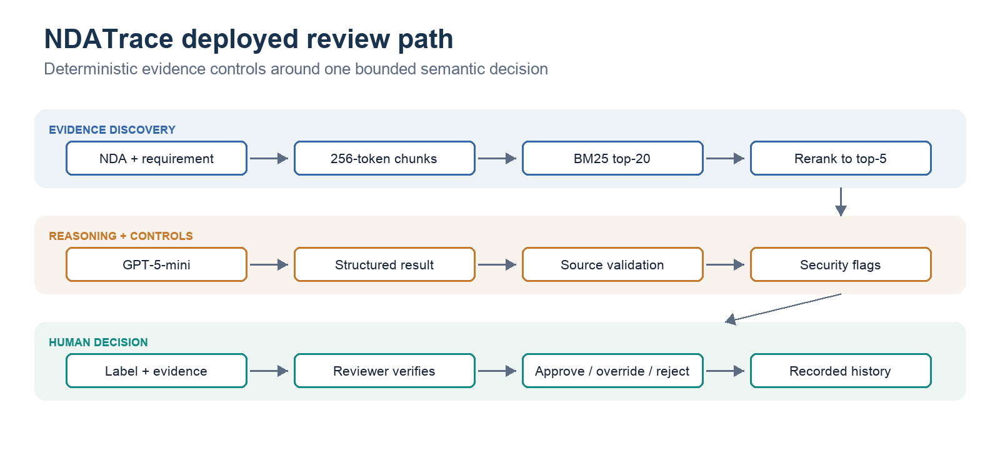
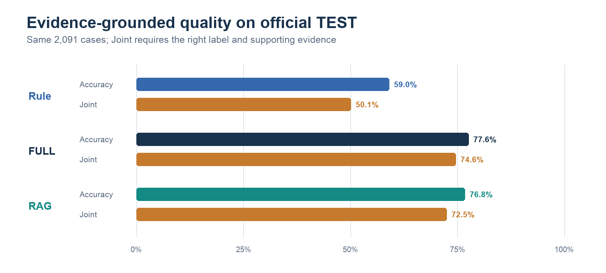
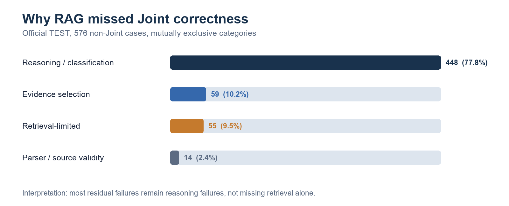
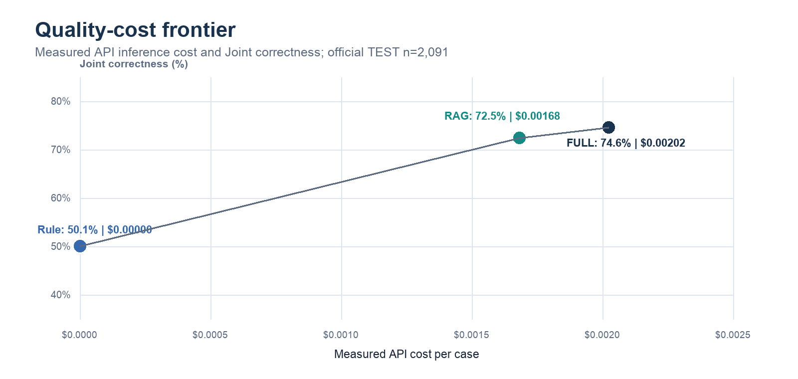
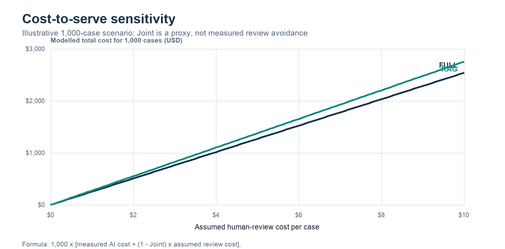

# NDATrace: Does Additional AI Complexity Earn Its Place?

*Ubaidulla Asmitha | PE6201 Emerging AI Technologies | Final report | 1 October 2026*

## 1. Problem, persona and business value

Tina, an enterprise legal-operations analyst, reviews vendor NDAs against 17 confidentiality requirements before lawyer approval. Relevant clauses may be paraphrased, distributed across the document or qualified by distant exceptions, so keyword matching is inadequate. NDATrace helps Tina classify each requirement as Entailment, Contradiction or NotMentioned, while showing the source clause and an explanation for verification. It supports review; it does not approve, reject or negotiate contracts. A vendor survey of 286 legal professionals reports that 52% of organisations handle 101-1,000 contracts annually and most spend 2-4 hours per contract [1]. This establishes workload relevance, not measured productivity savings for NDATrace.

## 2. Approach and system architecture

I separated tasks that need semantic judgement from tasks that must remain predictable. Deterministic code performs clause-aware chunking, retrieval, reranking, schema checks, source validation, security flags and workflow limits. A rented GPT-5-mini model performs classification and evidence-grounded explanation. The deployed path uses 256-token chunks, BM25 top-20 candidates and a cross-encoder top-5 context. The reviewer sees the model result and cited text, then records the decision. This hybrid design bounds context and preserves auditability without claiming that validation makes model reasoning infallible.

*Figure 1. The deployed prototype. The tested agent is excluded because it did not establish incremental benefit.*

| Layer | Decision | Rationale |
| --- | --- | --- |
| Model | Rent GPT-5-mini | Avoid training and model-serving overhead |
| Retrieval, evaluation and orchestration | Build | Control domain logic, limits and reproducibility |
| Serving and reviewer interface | Build | Integrate evidence display and recorded human decisions |

<!-- pagebreak -->

## 3. Experimental methodology and progression

I fixed dataset roles, scored against annotated labels and evidence, and introduced complexity one layer at a time. ContractNLI supplies 607 public NDAs and 17 requirements. The official held-out TEST population contains 2,091 requirement-document cases; a separate 49-case DEV battery deliberately concentrates difficult patterns and is not statistically representative. Joint correctness - correct label plus sufficient gold-evidence overlap - is the primary evidence-grounded outcome. Model and prompt diagnostics retain their recorded populations and conditions; I do not combine scores across them.

| Experiment | Engineering question | Finding and decision |
| --- | --- | --- |
| Oracle | Retrieval or reasoning bottleneck? | Hosted GPT-5-mini reasoned substantially better than local models with gold evidence; invest in the hosted model and retrieval |
| Model selection | Which model merits further investment? | GPT-5-mini provided the strongest measured semantic performance |
| Prompt engineering | Do definitions or decision steps help? | The minimal prompt performed best; freeze it |
| Retrieval optimisation | Which evidence pipeline improves access? | BM25, dense and hybrid candidate generation converged after reranking; freeze the simpler BM25 plus reranker path |
| Architecture comparison | Does retrieval justify removing full context? | RAG reduced tokens and cost but lost some Joint correctness |
| Selective agent | Can tool use recover difficult cases? | No net Joint gain; exclude the agent from runtime |
| Confidence routing | Can low-cost signals safely automate escalation? | No tested policy met both workload and residual-error targets; retain review for every case |
| Robustness | Do grounding and safeguards survive attacks? | Deterministic controls help, but prompt-injection coverage remains incomplete |

## 4. Quality evaluation and architecture trade-offs

The official TEST benchmark is the primary evidence. Both LLM architectures materially outperform the rule baseline. FULL achieved 77.6% accuracy and 74.6% Joint correctness; RAG achieved 76.8% and 72.5%. The accuracy difference was not statistically significant (paired McNemar p=0.217), while FULL's 2.2-point Joint advantage was significant (p=0.0047). RAG's case is therefore bounded context and efficiency, not superior overall quality. Its contradiction recall was slightly higher on TEST, but the proposal's original risk-sensitive recall improvement target of at least five points was not reached.

| Metric | Rule | FULL | RAG |
| --- | ---: | ---: | ---: |
| Official TEST, n=2,091 |  |  |  |
| Accuracy | 59.0% | 77.6% | 76.8% |
| Joint correctness | 50.1% | 74.6% | 72.5% |
| Contradiction recall | 16.8% | 75.5% | 77.3% |
| Targeted DEV, n=49 |  |  |  |
| Accuracy | 51.0% | 73.5% | 71.4% |
| Joint correctness | 44.9% | 73.5% | 67.3% |
| Contradiction recall | 13.3% | 46.7% | 53.3% |

*Figure 2. Official TEST quality. Joint correctness exposes the gap between a correct label and a correct evidence-grounded answer.*

## 5. Failure analysis and robustness

Failures separate into evidence access, evidence selection and interpretation. On official TEST, 448 of RAG's 576 non-Joint cases were reasoning or classification failures even though relevant evidence was available; retrieval-limited cases accounted for 55. The targeted battery adds mechanism-level diagnosis: two RAG cases combined partial retrieval with incomplete citation, both architectures failed three of four documented exception cases, and one apparently permissive clause distracted FULL where RAG succeeded. One annotation was substantively debatable, reminding us that benchmark labels also require scrutiny. More context alone is therefore not a general remedy.

| Failure mechanism | Observed finding | Engineering implication |
| --- | --- | --- |
| Partial retrieval plus incomplete citation | Two targeted RAG cases missed the Joint threshold | Improve coverage and multi-span evidence selection separately |
| Exception interpretation | Both architectures failed three of four documented cases | Evaluate targeted exception reasoning independently |
| Distracting context | RAG succeeded where FULL over-weighted a permissive clause | Selective context can occasionally help |
| Annotation ambiguity | One targeted label was substantively debatable | Audit ground truth as well as predictions |

*Figure 3. Official TEST failure distribution; denominator is exactly 576 non-Joint RAG cases.*

In a small 20-pair robustness study, Joint correctness fell from 85% on clean inputs to 75% under attack, and 4 of 11 injection-pattern pairs succeeded. Length caps, spend limits, rate limiting, source validation and a deterministic injection guard reduce exposure, but source-valid text can still contain hostile instructions. NDATrace is evidence-grounded, not prompt-injection-hardened.

## 6. Cost-to-serve and business trade-offs

RAG halved mean input tokens (2,279 to 1,131), while mean output tokens changed much less (approximately 727 to 701). Total measured API cost fell 16.8%, from $0.00202 to $0.00168 per case, and latency was nearly unchanged. Input reduction therefore does not translate proportionally into total cost because output generation and fixed reasoning work remain. FULL still provides higher Joint correctness, so the cheaper inference path can create more potential review work.

| Measure | FULL | RAG |
| --- | ---: | ---: |
| Mean input tokens per case | 2,279 | 1,131 |
| Mean output tokens per case | 727 | 701 |
| Measured inference cost per case | $0.00202 | $0.00168 |
| Official TEST Joint correctness | 74.6% | 72.5% |
| Mean latency | 7.31 s | 7.14 s |

*Figure 4. Measured inference economics on the same 2,091 TEST cases.*

*Figure 5. Counterfactual sensitivity for 1,000 cases. Joint correctness is used only as a proxy for potential review need; NDATrace did not measure automatic review avoidance.*

The sensitivity model shows why sub-cent inference cost is not the business case. Once human-review cost is introduced, small quality differences can dominate model-price savings. Actual viability depends on reviewer time saved, error consequences and enterprise operating costs. Because every prototype result still requires oversight and no workplace study was conducted, I claim neither realised savings nor ROI.

## 7. Governance, limitations and prioritised improvement

The selective-agent and confidence-routing experiments did not justify autonomous escalation, so every case remains reviewable by a person. Production deployment would also require authentication, access controls, confidential-data handling, provider assessment and monitoring. ContractNLI is a public benchmark; its performance cannot establish accuracy on an organisation's NDA templates, negotiation practices or longer documents. Improvements should be evaluated against explicit failure mechanisms rather than added as architectural features by default.

| Risk | Current safeguard | Next measurable improvement |
| --- | --- | --- |
| Missed or scattered evidence | Source checking and human verification | Test retrieval coverage and multi-span citation |
| Misinterpreted exceptions | Human review | Build an independent exception-reasoning set |
| Prompt injection | Input guard, flags and limits | Broaden attack coverage and rerun paired tests |
| Incorrect automatic escalation | Human reviews every case | Validate stronger routing signals before automation |
| Sensitive enterprise contracts | Public-data prototype only | Assess access control, confidentiality and deployment architecture |

## 8. Conclusion

Increasing AI complexity did not produce progressively better outcomes. A hosted semantic model substantially improved on keyword rules; retrieval reduced context and inference cost but traded away some evidence-grounded correctness; and the tested agent and confidence router earned no place in the runtime. NDATrace is therefore an evidence-grounded reviewer-assistance prototype with explicit human authority and measurable limitations, not an autonomous legal decision-maker.

## References and evidence base

[1] LegalOn Technologies and In-House Connect, "2025 State of Contracting Survey," 15 January 2025, https://www.legalontech.com/press-releases/2025-survey. Vendor research; not independently verified academic evidence.

[2] Canonical project artifacts: `experiments/E20_final_rag_test/results/E20_final_report.json`; `results/final/v2/full_test_comparison.csv`; `experiments/E24_targeted_evaluation/results/e24_analysis.json`; `results/final/v2/robustness_summary.json`; `results/business_economics_scenario.json`.
