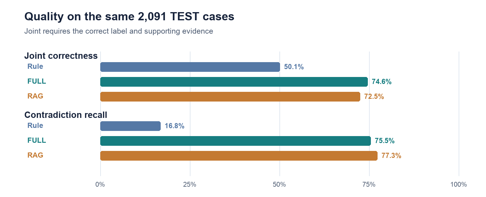
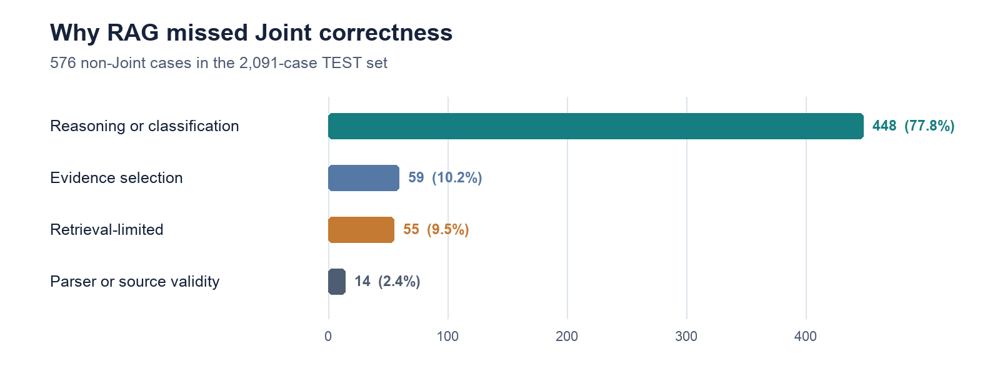

# NDATrace — Evidence-Grounded NDA Requirement Review

*Ubaidulla Asmitha · PE6201 End-of-Course Project · 2026-10-01*

## The problem and the user

Tina, a legal operations analyst, checks each vendor NDA against standard confidentiality
requirements before a lawyer decides what to do. Relevant wording may be paraphrased, qualified
by an exception, or spread across clauses. Keyword search misses those relationships; an uncited
LLM answer can sound convincing without letting Tina verify it. A
[LegalOn Technologies survey](https://www.legalontech.com/press-releases/2025-survey) (2025,
n=286) reports that 52% of organizations handle 101–1,000 contracts annually and most spend 2–4
hours per review — vendor research, not evidence of NDATrace's impact; this project has not
measured review-time savings. NDATrace is a reviewer's aid: it labels each requirement
Entailment, Contradiction, or NotMentioned, cites the NDA text, and records Tina's final
decision. It does not approve an NDA. What changes relative to today: Tina starts from a
labeled, cited first pass instead of a blank document, so review time shifts from locating
evidence to checking it — a different job, even though total time saved is unmeasured.

## Why AI, and why not the simplest baseline

I measured a $0 keyword-rule baseline first: 59.0% accuracy and 50.1% Joint correctness on the
2,091-case TEST split. It catches literal matches but misses paraphrases and cross-references; a
missed Contradiction can let a conflicting clause pass unnoticed. This measured gap justified
semantic classification with an LLM, while evidence checks and reviewer controls stayed
deterministic code.

## Data and evaluation protocol

[ContractNLI](https://stanfordnlp.github.io/contract-nli/) (Koreeda and Manning, 2021; CC BY 4.0)
contains 607 NDAs and 17 fixed requirements. The official TEST split has **123 documents and
2,091 document–requirement cases**. Gold labels and evidence spans are withheld from inference
and used only for scoring. The split was not tuned against this cycle, but an earlier superseded
run had scored it once, so it is not described as fully blind. Joint correctness requires
**both** the correct label and correct supporting evidence; I also report Contradiction recall
because missing an actual conflict matters more than aggregate accuracy alone.

## Model and architecture selection

I compared keyword rules, FULL (the whole NDA and requirement sent to GPT-5-mini), RAG
(clause-aware chunks → BM25 top-20 → cross-encoder top-5 → GPT-5-mini), and a selective agent
above RAG. The reviewer screen, retrieval pipeline, evaluation, evidence validation, rate/cost
limits, and decision log are project code; the model and standard libraries are rented or reused.
An oracle experiment supplied gold evidence directly and reached 90.6% macro-F1 on 300 cases —
showing room for improvement in the end-to-end pipeline, **not** a TEST result or proof that
reasoning errors were absent.

Several components were tuned empirically rather than assumed. Prompt structure (E03): a minimal
prompt (P0) beat two more structured versions on Contradiction recall (22.0% vs 6.0% vs 2.0%) —
the opposite of the pre-registered hypothesis that structure would help — so P0 was frozen.
Retrieval (E06): 256-token clause-aware chunks, BM25 over a dense retriever (near-exact tie,
simplicity as tie-break), and a cross-encoder reranker narrowing top-20 to top-5, which alone
recovered 159 net cases. A later GPT-specific prompt variant was tested twice and not adopted.

## What the experiments actually showed

On the full matched TEST population (n=2,091), FULL and RAG produced a genuine trade-off rather
than one clearly beating the other:

| Metric | FULL | RAG |
|---|---:|---:|
| Accuracy | 77.6% | 76.8% |
| Macro-F1 | 0.727 | 0.723 |
| Joint (label + evidence) | 74.6% | 72.5% |
| Contradiction recall | 75.5% | 77.3% |
| Input tokens/case | 2,279 | 1,131 |
| Cost/case | $0.00202 | $0.00168 |

*Figure 1. Same 2,091 TEST cases; Joint requires the label and evidence to be right. Source: saved E17/E20 results and the rule baseline.*

Paired McNemar tests on the identical 2,091 cases show accuracy is not significantly different
(p=0.217), but FULL is significantly better on joint success (p=0.0047) — the right label with
the right evidence, which is what "evidence-grounded" actually means. RAG caught **170 of 220**
Contradictions (77.3% recall, 95% Wilson interval 71.3–82.3%), but its Contradiction-specific
Joint result was only 153/220 (69.5%): some correct conflict labels still lacked correct
evidence, a silent failure a label-only score hides. My proposal's pre-registered target was a
≥5-point gain in risk-sensitive recall (mean of Contradiction/NotMentioned recall) for RAG over
FULL; the measured result is FULL 69.07% vs RAG 70.25% — a **+1.18-point gain, not the ≥5 I
targeted**. That target was not met, reported as measured rather than reframed around a
friendlier number.

I kept RAG as the served prototype despite FULL's 2.1-point Joint advantage: RAG used 50.4%
fewer input tokens and 16.8% less API spend per case, and gives Tina a ranked shortlist of
clauses. Retrieval bounds model input per requirement, though ingestion still grows with document
length; longer real NDAs remain untested, so scalability is a design rationale, not a measured
quality win.

## Two rejected escalations

I tested, rather than assumed, whether each added layer earned its cost. The selective agent (15
escalated calls of 150 test cases) made **zero tool calls** on every triggered case, and net
joint-success benefit was exactly 0.0pp (one recovery cancelled by one regression) for $0.0218 of
real added spend — not carried into the runtime. Separately, four automatic confidence-routing
policies (n=138) were tested: the best under a 40% review-workload ceiling still let through
22.9% residual joint error, and the policy catching most failures required reviewing 51.4% of
cases — none reached both an acceptable workload and residual-error rate. Deterministic runtime
signals cannot reliably detect confident reasoning errors here, so the shipped system has no
automatic confidence gate; every result goes to a human.

*Figure 2. Of 576 non-Joint RAG results, 448 were reasoning/classification failures and only 55 were retrieval-limited. Source: E20 failure taxonomy.*

## Business impact: measured cost vs. a modeled review cost

API cost is measured; total workflow cost is not. RAG costs $0.00168/case, 16.8% less than
FULL's $0.00202 — but that is only the model call. To estimate total cost without fabricating a
labor study, I modeled five minutes of manual review at $40/hour ($3.33/case), charged only
against non-Joint outcomes. This **unvalidated** assumption reverses the apparent winner: all-in,
FULL is cheaper ($0.85/case) than RAG ($0.92/case), since FULL's higher Joint rate avoids more
review cost than RAG saves on API calls. Takeaway: a token-efficient model is not automatically
the cheaper system once human review is priced in. Every result still receives human review
regardless of this estimate, which is sensitivity analysis, not a savings forecast.

## Human oversight and security

Because no automatic gate exists, every result carries the retrieved evidence and a
needs-human-review flag for Tina to check before acting. I implemented a reviewer decision API
recording Approve, Override, or Reject with an append-only note. A tested attack inserted
instructions into an NDA: the guard flagged it for review and the model did not comply. In an
earlier **pre-remediation** study, 4 of 11 injection attacks succeeded; the later guard's
targeted retest was rated **PARTIAL** (the same 11 attacks were not rerun, so no post-fix
detection rate is claimed). Cost/rate enforcement was added and retested after an initial
failure, but the prototype has no authentication or distributed rate limiting, and is restricted
to public or synthetic NDAs; no automatic legal decision is made.

## Critique: what the evaluation can and cannot tell us

Joint correctness is strict — an exact label and a matched span — but ContractNLI publishes no
human inter-annotator baseline, so there is no independent number for what a "good" Joint score
should be. Evidence matching has already moved the numbers once: a formatting-normalized
fallback (E13B) recovered 41 cases the original matcher missed — the metric has edges, not just
the model. All headline numbers are a single run at temperature 0 on one split, one realization,
not a guaranteed reproduction.

The architecture outcome is a genuine trade-off, not a clean win: FULL wins on Joint correctness
and all-in cost, yet RAG was kept as the served prototype for its per-call cost and scalability
rationale. ContractNLI is a proxy for enterprise contracts; longer real NDAs and reviewer time
remain untested. The main residual error is semantic, not structural: 448 of RAG's 576 non-Joint
cases were reasoning failures, only 55 retrieval-limited (Figure 2) — more retrieval alone will
not fix most of it. This is an academic prototype, not a production legal system.

The highest-value next step is validating the $40/hour review-cost assumption with real
reviewers, turning the cost comparison from illustrative to measured; secondary priorities are
testing on longer real NDAs beyond ContractNLI's scope and revisiting confidence routing with a
different signal.

## Reproducibility and sources

The [repository README](../README.md) describes setup and the experiment map.
`python scripts/verify_reproducibility.py` checks the dataset checksum, tests, saved-prediction
analyses, result drift, and backend responses without paid model calls. Primary numbers come
from [E20's full TEST report](../experiments/E20_final_rag_test/results/E20_final_report.json)
and the [matched baseline comparison](../results/final/v2/full_test_comparison.csv); the
[security report](../experiments/E22_targeted_security_remediation/results/final_report.json)
records the post-fix checks. Figures are generated directly from saved results.
